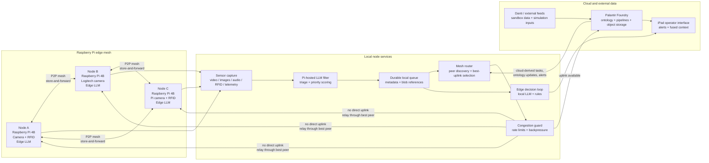
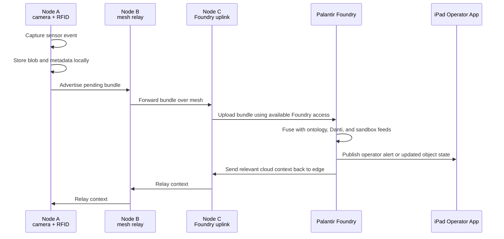
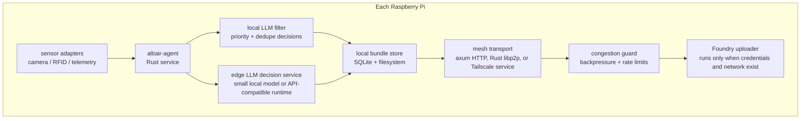

# Altiair

Altiair is a hackathon prototype for resilient edge sensing in unreliable network environments. Raspberry Pi nodes form a peer-to-peer mesh, collect sensor data, and forward video, image, audio, RFID, and other telemetry through whichever node currently has the best cloud path. If any node can reach Palantir Foundry, the rest of the mesh can daisy chain through it to synchronize data and receive cloud-enriched operator updates.

## Architecture



## Daisy Chain Upload Path



## Hackathon Hardware

| Quantity | Equipment | Role |
| --- | --- | --- |
| 3 | Raspberry Pi 4B with power supplies and Raspberry Pi OS | Mesh nodes, sensor ingest, local inference, relay routing |
| 1 | Logitech USB camera | Video/image capture on one node |
| 1 | Raspberry Pi camera sensor | Video/image capture on one node |
| 1+ | RFID sensors | Local identity, asset, or checkpoint events |

## Local LLM Selection

The local LLM is part of the networking control plane. Its job is not open-ended chat; it filters sensor bundles, summarizes bulky media, detects duplicates, assigns priority, and prevents the mesh from jamming the selected Foundry upload gateway.

| Device | Primary model | Runtime | Role |
| --- | --- | --- | --- |
| Raspberry Pi 4B | [`Qwen3-0.6B`](https://huggingface.co/Qwen/Qwen3-0.6B) with [4-bit GGUF quant](https://huggingface.co/unsloth/Qwen3-0.6B-GGUF) | [`llama.cpp`](https://github.com/ggml-org/llama.cpp) | Fast text/metadata triage, JSON forwarding decisions, dedupe, summarization |
| Raspberry Pi 4B fallback | [`SmolLM2-360M-Instruct`](https://huggingface.co/HuggingFaceTB/SmolLM2-360M-Instruct) with [GGUF quant](https://huggingface.co/QuantFactory/SmolLM2-360M-Instruct-GGUF) | `llama.cpp` | Lower-memory fallback if Pi 4B thermals or RAM are constrained |
| Jetson Orin Nano / NX / AGX | Gemma E2B-class model through [Jetson AI Lab](https://www.jetson-ai-lab.com/tutorials/gemma4-on-jetson/) | Jetson `llama.cpp` container or `vLLM` | Heavier multimodal inference for image/audio/video-rich bundles |
| Jetson production stretch | [`Qwen3-4B-Instruct`](https://www.jetson-ai-lab.com/tutorials/tensorrt-edge-llm/) INT4 AWQ | TensorRT Edge-LLM | Optimized C++/TensorRT inference path for a stronger edge gateway |

Recommended split:

- Run `Qwen3-0.6B` on every Raspberry Pi as the always-on filter.
- Use the Jetson as the optional higher-capability edge inference node for thumbnails, selected images, short clips, and audio snippets.
- Use deterministic Rust rules as the fallback when the model server is unavailable.
- Force short JSON output for all Pi filtering decisions.

### Raspberry Pi LLM Setup

Run this once on each Raspberry Pi with internet access:

```bash
sudo apt update
sudo apt install -y git cmake build-essential curl
git clone https://github.com/ggml-org/llama.cpp.git
cd llama.cpp
cmake -B build
cmake --build build --config Release -j 4
```

Download and serve the primary Pi model:

```bash
./build/bin/llama-server \
  -hf unsloth/Qwen3-0.6B-GGUF:Q4_K_M \
  --host 0.0.0.0 \
  --port 8080 \
  -c 2048 \
  -np 1
```

If the Pi struggles with memory, thermals, or latency, switch to the smaller fallback model:

```bash
./build/bin/llama-server \
  -hf QuantFactory/SmolLM2-360M-Instruct-GGUF:Q4_K_M \
  --host 0.0.0.0 \
  --port 8080 \
  -c 1024 \
  -np 1
```

Use non-thinking, constrained prompts for the Raspberry Pi path. The response must be compact JSON:

```bash
curl http://127.0.0.1:8080/v1/chat/completions \
  -H 'Content-Type: application/json' \
  -d '{
    "messages": [
      {
        "role": "system",
        "content": "Return only JSON with decision, priority, media_strategy, duplicate_probability, and reason. Valid decisions: send_now, summarize_first, hold, drop_duplicate."
      },
      {
        "role": "user",
        "content": "node=altiair-node-a sensor=camera event=motion near checkpoint confidence=0.72 media_size_mb=3.4 network=degraded gateway_queue=high"
      }
    ],
    "temperature": 0.1,
    "max_tokens": 120
  }'
```

Expected shape:

```json
{
  "decision": "summarize_first",
  "priority": 74,
  "media_strategy": "thumbnail_first",
  "duplicate_probability": 0.08,
  "reason": "degraded network and saturated gateway; send compact evidence first"
}
```

### Jetson LLM Setup

For Jetson Orin-class devices, start with NVIDIA's Jetson AI Lab runtime because it is built for the Jetson software stack.

Recommended Orin Nano path:

```bash
sudo docker run -it --rm --pull always --runtime=nvidia --network host \
  -v $HOME/.cache/huggingface:/root/.cache/huggingface \
  ghcr.io/nvidia-ai-iot/llama_cpp:latest-jetson-orin \
  llama-server -hf unsloth/gemma-4-E2B-it-GGUF:Q4_K_S \
    --host 0.0.0.0 \
    --port 8081
```

Production stretch path:

- Export and quantize `Qwen3-4B-Instruct` with INT4 AWQ using TensorRT Edge-LLM.
- Build the TensorRT engine on the target Jetson.
- Serve inference from the native C++ runtime so the gateway does not depend on Python during the demo.

### LLM Test Plan

Every Pi and Jetson LLM runtime must pass these tests before it is allowed into the mesh:

| Test | Command or signal | Pass condition |
| --- | --- | --- |
| Runtime health | `GET /health` from `llama-server` or local wrapper | Server responds locally within 2 seconds |
| JSON decision | Send the smoke-test prompt above | Valid JSON with one allowed `decision` |
| Latency budget | Run 10 short prompts | Pi median response is acceptable for demo triage; Jetson is faster than Pi for richer prompts |
| Backpressure behavior | Prompt with `gateway_queue=high` | Model chooses `summarize_first`, `hold`, or another low-bandwidth strategy |
| Priority behavior | Prompt with urgent threat text | Model chooses `send_now` with high priority |
| Fallback behavior | Stop model server | Rust deterministic rules still produce a forwarding decision |
| Integration path | `POST /bundles/{bundle_id}/decision` | Decision is stored with the bundle and visible through `GET /observations` |

The LLM output is advisory. The Rust node agent enforces hard network protections even if the model gives a bad answer.

Research references:

- [Raspberry Pi 4B specifications](https://www.raspberrypi.com/products/raspberry-pi-4-model-b/specifications/)
- [Qwen3-0.6B model card](https://huggingface.co/Qwen/Qwen3-0.6B)
- [Qwen3-0.6B GGUF quantizations](https://huggingface.co/unsloth/Qwen3-0.6B-GGUF)
- [SmolLM2-360M-Instruct model card](https://huggingface.co/HuggingFaceTB/SmolLM2-360M-Instruct)
- [Jetson AI Lab Gemma on Jetson guide](https://www.jetson-ai-lab.com/tutorials/gemma4-on-jetson/)
- [Jetson AI Lab TensorRT Edge-LLM guide](https://www.jetson-ai-lab.com/tutorials/tensorrt-edge-llm/)

## Workstreams

The hackathon should split into four parallel workstreams with a narrow integration contract between them. Each team should expose a small Rust CLI command or HTTP endpoint that the other teams can call without needing to understand the internals.

The edge stack should be Rust-first for memory safety and deployment reliability on Raspberry Pi. Use Swift/SwiftUI for the native iPad app because Swift is the memory-safe native framework for iPadOS.

| Workstream | Primary goal | Day-one output |
| --- | --- | --- |
| Raspberry Pi networking | Bring up a resilient peer-to-peer network across all Pis | Three nodes can discover each other, exchange heartbeats, and report peer health |
| Foundry integration | Move Pi-generated bundles into Palantir Foundry and read back cloud context | One Pi can upload a sample bundle and receive or simulate an acknowledgement |
| Sensor filtering, forwarding, and gateway selection | Use Pi-hosted LLM filtering, forward high-value bundles across Pis, and choose which Pi should upload to Foundry | A disconnected node can route prioritized data to the best Foundry-connected gateway without jamming it |
| iPad operator interface | Give operators a field-ready view of mesh health, sensor events, and cloud-fused alerts | An iPad can connect to a Pi gateway and display live node status, observations, and alerts |

### Workstream 1: Raspberry Pi Networking

**Owner focus:** local connectivity, peer identity, and health reporting.

Tasks:

- Assign stable node names: `altiair-node-a`, `altiair-node-b`, and `altiair-node-c`.
- Establish local network connectivity between all Pis using the fastest reliable option available during the hackathon.
- Start with static peer configuration if automatic discovery costs too much time.
- Add a lightweight Rust heartbeat endpoint on each node.
- Track peer state: online/offline, last seen, IP address, latency, and packet success.
- Expose a local status endpoint such as `GET /peers`.

Recommended day-one approach:

- Use `axum` and `tokio` for HTTP between known peer IPs first.
- Use Rust `libp2p`, Wi-Fi Direct, or ad hoc mesh as stretch goals once the demo path works.
- Use `systemd` or a simple shell script to start the node agent on boot.

Acceptance criteria:

- Each Pi can list the other two Pis.
- Each Pi can send and receive a heartbeat.
- Pulling network from one Pi does not prevent the other two from continuing to communicate.
- The iPad app or Rust CLI can show mesh health.

### Workstream 2: Raspberry Pi to Foundry Integration

**Owner focus:** authentication, upload shape, Foundry dataset or object mapping, and cloud acknowledgements.

Tasks:

- Confirm the available Foundry sandbox endpoint, credentials, and upload method.
- Define the minimum bundle format Foundry will accept.
- Implement a small Rust uploader that can send `metadata.json` plus optional media blobs.
- Map uploaded bundles into Foundry concepts such as `SensorObservation`, `Track`, `Alert`, `Asset`, and `Location`.
- Return an acknowledgement receipt containing Foundry object ids, upload status, and any cloud-enriched context.
- Provide a mock uploader mode if credentials or sandbox setup are blocked.

Recommended day-one approach:

- First upload JSON-only bundles.
- Add images, video, audio, and RFID payloads after the metadata path works.
- Keep the uploader isolated behind one Rust command or endpoint such as `POST /foundry/upload`.
- Use `reqwest`, `rustls`, `serde`, and `tokio` for the upload path.

Acceptance criteria:

- One Pi can upload or simulate upload of a real sensor bundle.
- The uploader returns a deterministic acknowledgement.
- The returned acknowledgement can be forwarded back through the mesh.
- The demo can show the same event in local node state and in Foundry or the mock Foundry sink.

### Workstream 3: Sensor Filtering, Forwarding, and Gateway Selection

**Owner focus:** Pi-hosted LLM filtering, store-and-forward routing, bundle replication, network protection, and choosing the best Foundry gateway.

Tasks:

- Create a local durable queue for captured sensor bundles.
- Host a lightweight LLM or vision-language model on each Raspberry Pi to triage sensor data before it enters the forwarding queue.
- Install `llama.cpp`, download the selected GGUF model, and run the local inference smoke test on every Pi.
- Score each bundle for mission relevance, urgency, confidence, media size, and upload cost.
- Add bundle states: `pending`, `held`, `forwarded`, `uploading`, `uploaded`, and `failed`.
- Implement peer-to-peer bundle transfer between Pis in the Rust node agent.
- Advertise each node's uplink score to peers.
- Select the current Foundry gateway based on reachability, recent upload success, latency, and bandwidth.
- Forward bundles to the selected gateway and propagate upload acknowledgements back to the origin node.
- Apply backpressure so peers slow down or pause forwarding when the selected gateway is saturated.
- Protect the mesh with per-peer rate limits, maximum in-flight bundle counts, retry jitter, and queue watermarks.

Recommended day-one approach:

- Use SQLite through `sqlx` or `rusqlite` for metadata and the filesystem for media blobs.
- Use the Pi-hosted LLM to send metadata, thumbnails, short clips, and high-priority events first; hold or summarize low-value raw media until bandwidth improves.
- Use deterministic scoring before trying complex routing:

```text
bundle_priority = mission_relevance * 40
                + urgency * 30
                + confidence * 20
                - media_size_mb
                - duplicate_penalty

gateway_score = foundry_reachable * 100
              + internet_reachable * 50
              + recent_upload_success * 25
              - latency_ms / 100
              - pending_upload_count
              - gateway_cpu_load
```

Acceptance criteria:

- A node without internet can enqueue a sensor bundle.
- Each Pi passes the LLM runtime health, JSON decision, latency, and fallback tests.
- The local LLM can mark a bundle as `send_now`, `summarize_first`, `hold`, or `drop_duplicate`.
- Another node can receive and store that bundle.
- The best-connected node is selected as the gateway.
- Upload acknowledgement returns to the originating node.
- Duplicate uploads are avoided using `bundle_id`.
- The selected gateway refuses or slows new transfers when its queue, CPU, memory, or network usage crosses a configured threshold.
- Low-priority media does not block urgent alerts from reaching Foundry.

### Workstream 4: iPad Operator Interface

**Owner focus:** Swift/iPadOS interface for operators who need fast situational awareness from edge and cloud data.

Tasks:

- Build a native iPad app using SwiftUI.
- Connect the iPad to the Raspberry Pi mesh through the current gateway node.
- Show live mesh health: nodes online, gateway node, peer quality, and pending upload counts.
- Show incoming sensor observations with timestamp, source node, sensor type, media preview, and upload status.
- Show Foundry-enriched alerts and recommended operator actions.
- Provide a degraded/offline state when Foundry is unreachable but local mesh data is still available.
- Add a simple acknowledgement action so an operator can mark an alert as seen during the demo.

Recommended day-one approach:

- Build against mocked JSON first so the UI can move independently.
- Use one Pi-hosted API base URL such as `http://altiair-node-c.local:8000`.
- Poll every few seconds before adding WebSockets or push updates.
- Optimize for a landscape iPad layout with three panes: mesh status, observation feed, and selected alert detail.

Acceptance criteria:

- The iPad can connect to at least one Raspberry Pi node on the local network.
- The UI shows all three nodes and clearly identifies the current Foundry gateway.
- The UI updates when a new sensor bundle is created or forwarded.
- The UI shows whether each event is local-only, forwarded, uploading, uploaded, or failed.
- The UI can display at least one cloud-enriched or simulated Foundry alert.
- The demo remains usable if Foundry is offline by showing cached mesh state and local observations.

### Integration Contract Between Workstreams

Every node should expose the same minimal API so the workstreams can integrate quickly:

| Endpoint | Purpose |
| --- | --- |
| `GET /health` | Returns node id, uptime, service status, and local clock |
| `GET /peers` | Returns known peers and last heartbeat status |
| `GET /gateway` | Returns current gateway candidate and score |
| `POST /bundles` | Receives a sensor bundle from local capture or another Pi |
| `GET /bundles/pending` | Lists bundles that still need forwarding or upload |
| `POST /bundles/{bundle_id}/ack` | Records Foundry upload acknowledgement |
| `POST /foundry/upload` | Uploads a bundle when this node is the selected gateway |
| `GET /congestion` | Returns queue depth, in-flight transfers, CPU, memory, network usage, and gateway saturation state |
| `POST /bundles/{bundle_id}/decision` | Records the local LLM decision to send, summarize, hold, or drop a bundle |
| `GET /observations` | Returns recent local, forwarded, and uploaded sensor observations for the iPad UI |
| `GET /alerts` | Returns edge-generated and Foundry-enriched alerts for the iPad UI |
| `POST /alerts/{alert_id}/ack` | Records operator acknowledgement from the iPad UI |

## One-Day Build Plan

1. **Prepare the Pis**
   - Flash or verify Raspberry Pi OS on all three devices.
   - Set hostnames such as `altiair-node-a`, `altiair-node-b`, and `altiair-node-c`.
   - Enable SSH, camera support, and required interfaces for RFID hardware.
   - Install the Rust toolchain, Docker or systemd services, camera utilities, and networking tools.

2. **Install and test local LLM inference**
   - Build `llama.cpp` on each Raspberry Pi.
   - Download the selected Pi GGUF model while internet is available.
   - Start `llama-server` on each Pi and run the JSON decision smoke test.
   - If the primary model is too slow or unstable, switch that node to the SmolLM2 fallback.
   - If a Jetson is available, start the Jetson AI Lab `llama.cpp` container and run a richer image/audio/video triage test.
   - Record median response time and whether each node is using `qwen3-0.6b`, `smollm2-360m`, or Jetson-hosted inference.

3. **Create the peer-to-peer mesh**
   - Use Wi-Fi ad hoc, Wi-Fi Direct, Tailscale, or Rust `libp2p` depending on network constraints.
   - Each node should advertise:
     - node id
     - reachable peer addresses
     - battery/power status if available
     - current internet quality
     - Foundry upload capability
   - Start with a simple heartbeat and peer table before adding automatic routing.

4. **Capture sensor bundles**
   - Normalize each event into a bundle:
     - `metadata.json`
     - optional `image.jpg`
     - optional `video.mp4`
     - optional `audio.wav`
     - optional `rfid.json`
     - optional `telemetry.json`
   - Store bundles locally until acknowledged by Foundry.
   - Include timestamps, node id, sensor type, geolocation if available, and confidence.

5. **Filter and protect the forwarding path**
   - Run a lightweight LLM or deterministic fallback on each Pi to classify bundles before forwarding.
   - Prioritize urgent alerts, compact metadata, thumbnails, and short clips before large raw media.
   - Hold low-value or duplicate data locally when the mesh or selected gateway is saturated.
   - Enforce per-peer rate limits, maximum in-flight transfers, queue high-water marks, and retry backoff.

6. **Route through the best uplink**
   - Score each node by cloud reachability, bandwidth, latency, and recent upload success.
   - If a node cannot reach Foundry, it forwards bundles to the best peer.
   - The selected uplink node uploads to Foundry and returns acknowledgement receipts through the mesh.

7. **Fuse with Foundry, sandbox data, and Danti**
   - Upload edge bundles into a Foundry dataset or object-backed ingestion path.
   - Map events into ontology objects such as `SensorObservation`, `Asset`, `Track`, `Alert`, and `Location`.
   - Join with Foundry sandbox and Danti-derived simulation data to create demo scenarios.

8. **Add the iPad operator interface**
   - Build a SwiftUI iPad app that connects to the current Pi gateway.
   - Show mesh health, active nodes, pending uploads, recent observations, and generated alerts.
   - Highlight which node is acting as the current Foundry gateway.
   - Provide concise decision support from edge LLM outputs and cloud ontology context.

## Suggested Prototype Components



Recommended first-pass implementation:

- **Language:** Rust for the Raspberry Pi edge agent, mesh routing, bundle queue, and Foundry uploader.
- **Node service:** `axum` on `tokio` for peer endpoints, local status, and iPad-facing APIs.
- **Data contracts:** `serde` and `serde_json` for bundle metadata, peer state, alerts, and Foundry acknowledgements.
- **Local storage:** SQLite through `sqlx` or `rusqlite` for bundle metadata, filesystem for media blobs.
- **Peer transport:** `axum` HTTP between known peers for day-one reliability; swap to Rust `libp2p` after the demo path works.
- **Camera capture:** call `libcamera` tools from the Rust agent or use Rust camera bindings where stable; keep media encoding behind a narrow process boundary.
- **RFID ingest:** use a Rust SPI/I2C/GPIO crate matched to the RFID sensor module; isolate any vendor driver behind a small adapter.
- **Uploader:** Rust `reqwest` with `rustls`, Foundry REST API, or a sandbox upload endpoint depending on available credentials.
- **Edge LLM:** Pi-hosted lightweight model for filtering, prioritization, summarization, dedupe, and operator decision support; use deterministic Rust rules as a fallback.
- **Network protection:** enforce backpressure, per-peer rate limits, in-flight transfer caps, retry jitter, queue watermarks, and gateway saturation checks before forwarding.
- **Operator app:** SwiftUI iPad app polling the Pi gateway API for mesh health, observations, alerts, and acknowledgements.

## Demo Scenario

1. Node A captures a camera frame or RFID event while disconnected from the internet.
2. Node A stores the bundle locally and announces it to peers.
3. Node C has the best internet path and Foundry access.
4. Node A forwards the bundle through Node B or directly to Node C.
5. Node C uploads the bundle to Foundry.
6. Foundry fuses the observation with sandbox and Danti data.
7. The iPad operator app receives an alert such as:
   - inbound aerial object detected near a protected area
   - unknown vehicle track approaching a checkpoint
   - cloud feed indicates a hazard near the current operating location
8. The edge mesh receives the relevant cloud context so disconnected operators still get the latest actionable state when a peer reconnects.

## Data Flow Contract

```json
{
  "bundle_id": "node-a-20260502T120000Z-0001",
  "node_id": "altiair-node-a",
  "captured_at": "2026-05-02T12:00:00Z",
  "sensor_type": "camera",
  "media": [
    {
      "type": "image",
      "path": "image.jpg",
      "sha256": "..."
    }
  ],
  "rfid": null,
  "telemetry": {
    "lat": null,
    "lon": null,
    "network_quality": "offline"
  },
  "edge_assessment": {
    "summary": "motion detected near checkpoint",
    "confidence": 0.72,
    "recommended_action": "review",
    "llm_forwarding_decision": "send_now",
    "priority": 81,
    "duplicate_probability": 0.08,
    "network_cost": {
      "estimated_bytes": 245760,
      "media_strategy": "thumbnail_first"
    }
  },
  "upload": {
    "status": "pending",
    "preferred_gateway": "altiair-node-c",
    "backpressure": {
      "gateway_saturated": false,
      "retry_after_seconds": null
    }
  }
}
```

## Success Criteria

- Three Raspberry Pis can discover or reach each other on a local mesh.
- At least one Pi captures real camera or RFID data.
- A disconnected Pi can pass a sensor bundle to another Pi.
- Each Pi can use a local LLM or deterministic fallback to filter, prioritize, summarize, hold, or drop duplicate sensor data before forwarding.
- The mesh protects the selected upload gateway with backpressure, rate limits, and queue thresholds.
- The best-connected Pi can upload or simulate upload into Foundry.
- The iPad operator app shows node status, pending bundles, uploaded bundles, and fused alerts.
- Edge LLM or rule-based fallback produces a decision-support summary from sensor data.
