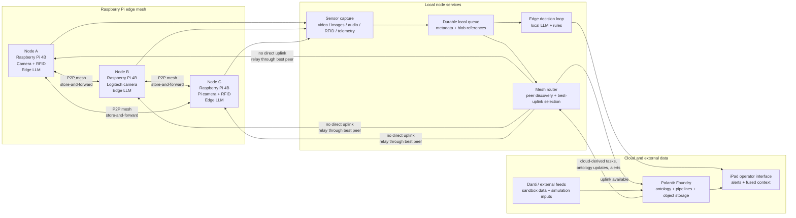
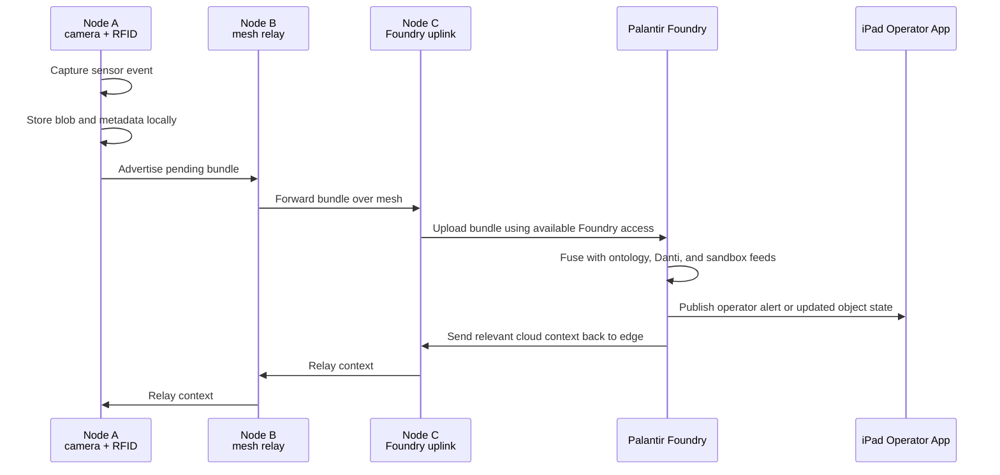
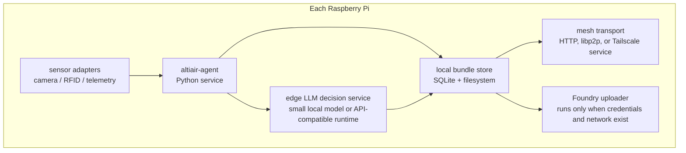

# Altiair

Altiair is a hackathon prototype for resilient edge sensing in unreliable network environments. Raspberry Pi nodes form a peer-to-peer mesh, collect sensor data, and forward video, image, audio, RFID, and other telemetry through whichever node currently has the best cloud path. If any node can reach Palantir Foundry, the rest of the mesh can daisy chain through it to synchronize data and receive cloud-enriched operator updates.

## Architecture



## Daisy Chain Upload Path



## Hackathon Hardware

| Quantity | Equipment | Role |
| --- | --- | --- |
| 3 | Raspberry Pi 4B with power supplies and Raspberry Pi OS | Mesh nodes, sensor ingest, local inference, relay routing |
| 1 | Logitech USB camera | Video/image capture on one node |
| 1 | Raspberry Pi camera sensor | Video/image capture on one node |
| 1+ | RFID sensors | Local identity, asset, or checkpoint events |

## Workstreams

The hackathon should split into four parallel workstreams with a narrow integration contract between them. Each team should expose a small command or HTTP endpoint that the other teams can call without needing to understand the internals.

| Workstream | Primary goal | Day-one output |
| --- | --- | --- |
| Raspberry Pi networking | Bring up a resilient peer-to-peer network across all Pis | Three nodes can discover each other, exchange heartbeats, and report peer health |
| Foundry integration | Move Pi-generated bundles into Palantir Foundry and read back cloud context | One Pi can upload a sample bundle and receive or simulate an acknowledgement |
| Sensor forwarding and gateway selection | Forward bundles across Pis and choose which Pi should upload to Foundry | A disconnected node can route data to the best Foundry-connected gateway |
| iPad operator interface | Give operators a field-ready view of mesh health, sensor events, and cloud-fused alerts | An iPad can connect to a Pi gateway and display live node status, observations, and alerts |

### Workstream 1: Raspberry Pi Networking

**Owner focus:** local connectivity, peer identity, and health reporting.

Tasks:

- Assign stable node names: `altiair-node-a`, `altiair-node-b`, and `altiair-node-c`.
- Establish local network connectivity between all Pis using the fastest reliable option available during the hackathon.
- Start with static peer configuration if automatic discovery costs too much time.
- Add a lightweight heartbeat endpoint on each node.
- Track peer state: online/offline, last seen, IP address, latency, and packet success.
- Expose a local status endpoint such as `GET /peers`.

Recommended day-one approach:

- Use HTTP between known peer IPs first.
- Keep libp2p, Wi-Fi Direct, or ad hoc mesh as stretch goals once the demo path works.
- Use `systemd` or a simple shell script to start the node agent on boot.

Acceptance criteria:

- Each Pi can list the other two Pis.
- Each Pi can send and receive a heartbeat.
- Pulling network from one Pi does not prevent the other two from continuing to communicate.
- The operator UI or CLI can show mesh health.

### Workstream 2: Raspberry Pi to Foundry Integration

**Owner focus:** authentication, upload shape, Foundry dataset or object mapping, and cloud acknowledgements.

Tasks:

- Confirm the available Foundry sandbox endpoint, credentials, and upload method.
- Define the minimum bundle format Foundry will accept.
- Implement a small uploader that can send `metadata.json` plus optional media blobs.
- Map uploaded bundles into Foundry concepts such as `SensorObservation`, `Track`, `Alert`, `Asset`, and `Location`.
- Return an acknowledgement receipt containing Foundry object ids, upload status, and any cloud-enriched context.
- Provide a mock uploader mode if credentials or sandbox setup are blocked.

Recommended day-one approach:

- First upload JSON-only bundles.
- Add images, video, audio, and RFID payloads after the metadata path works.
- Keep the uploader isolated behind one local command or endpoint such as `POST /foundry/upload`.

Acceptance criteria:

- One Pi can upload or simulate upload of a real sensor bundle.
- The uploader returns a deterministic acknowledgement.
- The returned acknowledgement can be forwarded back through the mesh.
- The demo can show the same event in local node state and in Foundry or the mock Foundry sink.

### Workstream 3: Sensor Forwarding and Gateway Selection

**Owner focus:** store-and-forward routing, bundle replication, and choosing the best Foundry gateway.

Tasks:

- Create a local durable queue for captured sensor bundles.
- Add bundle states: `pending`, `forwarded`, `uploading`, `uploaded`, and `failed`.
- Implement peer-to-peer bundle transfer between Pis.
- Advertise each node's uplink score to peers.
- Select the current Foundry gateway based on reachability, recent upload success, latency, and bandwidth.
- Forward bundles to the selected gateway and propagate upload acknowledgements back to the origin node.

Recommended day-one approach:

- Use SQLite for metadata and the filesystem for media blobs.
- Use deterministic scoring before trying complex routing:

```text
gateway_score = foundry_reachable * 100
              + internet_reachable * 50
              + recent_upload_success * 25
              - latency_ms / 100
              - pending_upload_count
```

Acceptance criteria:

- A node without internet can enqueue a sensor bundle.
- Another node can receive and store that bundle.
- The best-connected node is selected as the gateway.
- Upload acknowledgement returns to the originating node.
- Duplicate uploads are avoided using `bundle_id`.

### Workstream 4: iPad Operator Interface

**Owner focus:** Swift/iPadOS interface for operators who need fast situational awareness from edge and cloud data.

Tasks:

- Build a native iPad app using SwiftUI.
- Connect the iPad to the Raspberry Pi mesh through the current gateway node.
- Show live mesh health: nodes online, gateway node, peer quality, and pending upload counts.
- Show incoming sensor observations with timestamp, source node, sensor type, media preview, and upload status.
- Show Foundry-enriched alerts and recommended operator actions.
- Provide a degraded/offline state when Foundry is unreachable but local mesh data is still available.
- Add a simple acknowledgement action so an operator can mark an alert as seen during the demo.

Recommended day-one approach:

- Build against mocked JSON first so the UI can move independently.
- Use one Pi-hosted API base URL such as `http://altiair-node-c.local:8000`.
- Poll every few seconds before adding WebSockets or push updates.
- Optimize for a landscape iPad layout with three panes: mesh status, observation feed, and selected alert detail.

Acceptance criteria:

- The iPad can connect to at least one Raspberry Pi node on the local network.
- The UI shows all three nodes and clearly identifies the current Foundry gateway.
- The UI updates when a new sensor bundle is created or forwarded.
- The UI shows whether each event is local-only, forwarded, uploading, uploaded, or failed.
- The UI can display at least one cloud-enriched or simulated Foundry alert.
- The demo remains usable if Foundry is offline by showing cached mesh state and local observations.

### Integration Contract Between Workstreams

Every node should expose the same minimal API so the workstreams can integrate quickly:

| Endpoint | Purpose |
| --- | --- |
| `GET /health` | Returns node id, uptime, service status, and local clock |
| `GET /peers` | Returns known peers and last heartbeat status |
| `GET /gateway` | Returns current gateway candidate and score |
| `POST /bundles` | Receives a sensor bundle from local capture or another Pi |
| `GET /bundles/pending` | Lists bundles that still need forwarding or upload |
| `POST /bundles/{bundle_id}/ack` | Records Foundry upload acknowledgement |
| `POST /foundry/upload` | Uploads a bundle when this node is the selected gateway |
| `GET /observations` | Returns recent local, forwarded, and uploaded sensor observations for the iPad UI |
| `GET /alerts` | Returns edge-generated and Foundry-enriched alerts for the iPad UI |
| `POST /alerts/{alert_id}/ack` | Records operator acknowledgement from the iPad UI |

## One-Day Build Plan

1. **Prepare the Pis**
   - Flash or verify Raspberry Pi OS on all three devices.
   - Set hostnames such as `altiair-node-a`, `altiair-node-b`, and `altiair-node-c`.
   - Enable SSH, camera support, and required interfaces for RFID hardware.
   - Install Python, Docker or systemd services, camera utilities, and networking tools.

2. **Create the peer-to-peer mesh**
   - Use Wi-Fi ad hoc, Wi-Fi Direct, Tailscale, or libp2p depending on network constraints.
   - Each node should advertise:
     - node id
     - reachable peer addresses
     - battery/power status if available
     - current internet quality
     - Foundry upload capability
   - Start with a simple heartbeat and peer table before adding automatic routing.

3. **Capture sensor bundles**
   - Normalize each event into a bundle:
     - `metadata.json`
     - optional `image.jpg`
     - optional `video.mp4`
     - optional `audio.wav`
     - optional `rfid.json`
     - optional `telemetry.json`
   - Store bundles locally until acknowledged by Foundry.
   - Include timestamps, node id, sensor type, geolocation if available, and confidence.

4. **Route through the best uplink**
   - Score each node by cloud reachability, bandwidth, latency, and recent upload success.
   - If a node cannot reach Foundry, it forwards bundles to the best peer.
   - The selected uplink node uploads to Foundry and returns acknowledgement receipts through the mesh.

5. **Fuse with Foundry, sandbox data, and Danti**
   - Upload edge bundles into a Foundry dataset or object-backed ingestion path.
   - Map events into ontology objects such as `SensorObservation`, `Asset`, `Track`, `Alert`, and `Location`.
   - Join with Foundry sandbox and Danti-derived simulation data to create demo scenarios.

6. **Add the iPad operator interface**
   - Build a SwiftUI iPad app that connects to the current Pi gateway.
   - Show mesh health, active nodes, pending uploads, recent observations, and generated alerts.
   - Highlight which node is acting as the current Foundry gateway.
   - Provide concise decision support from edge LLM outputs and cloud ontology context.

## Suggested Prototype Components



Recommended first-pass implementation:

- **Language:** Python for fast hardware integration.
- **Node service:** FastAPI or Flask for peer endpoints and local status.
- **Local storage:** SQLite for bundle metadata, filesystem for media blobs.
- **Peer transport:** HTTP between known peers for day-one reliability; swap to libp2p after the demo path works.
- **Camera capture:** `libcamera` for Pi camera, OpenCV or `ffmpeg` for Logitech USB camera.
- **RFID ingest:** Python RFID library matched to the available sensor module.
- **Uploader:** Foundry SDK, Foundry REST API, or a sandbox upload endpoint depending on available credentials.
- **Edge LLM:** small local model runtime when feasible; otherwise mock the interface with deterministic rules for the demo.
- **Operator app:** SwiftUI iPad app polling the Pi gateway API for mesh health, observations, alerts, and acknowledgements.

## Demo Scenario

1. Node A captures a camera frame or RFID event while disconnected from the internet.
2. Node A stores the bundle locally and announces it to peers.
3. Node C has the best internet path and Foundry access.
4. Node A forwards the bundle through Node B or directly to Node C.
5. Node C uploads the bundle to Foundry.
6. Foundry fuses the observation with sandbox and Danti data.
7. The iPad operator app receives an alert such as:
   - inbound aerial object detected near a protected area
   - unknown vehicle track approaching a checkpoint
   - cloud feed indicates a hazard near the current operating location
8. The edge mesh receives the relevant cloud context so disconnected operators still get the latest actionable state when a peer reconnects.

## Data Flow Contract

```json
{
  "bundle_id": "node-a-20260502T120000Z-0001",
  "node_id": "altiair-node-a",
  "captured_at": "2026-05-02T12:00:00Z",
  "sensor_type": "camera",
  "media": [
    {
      "type": "image",
      "path": "image.jpg",
      "sha256": "..."
    }
  ],
  "rfid": null,
  "telemetry": {
    "lat": null,
    "lon": null,
    "network_quality": "offline"
  },
  "edge_assessment": {
    "summary": "motion detected near checkpoint",
    "confidence": 0.72,
    "recommended_action": "review"
  },
  "upload": {
    "status": "pending",
    "preferred_gateway": "altiair-node-c"
  }
}
```

## Success Criteria

- Three Raspberry Pis can discover or reach each other on a local mesh.
- At least one Pi captures real camera or RFID data.
- A disconnected Pi can pass a sensor bundle to another Pi.
- The best-connected Pi can upload or simulate upload into Foundry.
- The iPad operator app shows node status, pending bundles, uploaded bundles, and fused alerts.
- Edge LLM or rule-based fallback produces a decision-support summary from sensor data.
