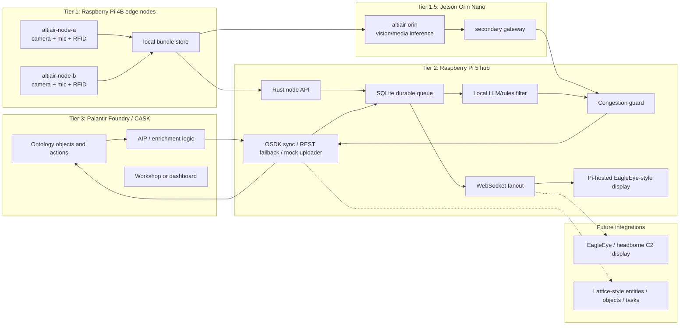

# Altiair

# Find Fix Target is our Demo

## A squad in a jammed, cloud-denied environment has eyes, ears, and personnel trackers — but no way to fuse them into a threat picture without a cloud connection.

Right now a squad in a DDIL environment has:
- A separate soldier who sees something
- Another sensor that hears something
- An RFID ping that goes silent elsewhere

Three signals. Zero fusion. No one connecting them automatically. The squad leader has to mentally stitch it together under fire, with degraded comms, while making a shoot/no-shoot decision.

The current solution is either:

A cloud-connected C2 system that's dead when the network is jammed
A human analyst behind a laptop that isn't at the tactical edge

---

Altiair is a hackathon prototype for resilient edge sensing in unreliable network environments. Raspberry Pi nodes form a peer-to-peer mesh, collect sensor data, and forward video, image, audio, RFID, and other telemetry through whichever node currently has the best cloud path. If any node can reach Palantir Foundry, the rest of the mesh can daisy chain through it to synchronize data and receive cloud-enriched operator updates.

This repo also includes the Palantir CASK/Foundry OSDK, local LLM, sensor-fusion, and Pi-hosted EagleEye-style display plan for producing evidence-grounded mission insight drafts in unreliable network environments.

Project lead: Sarah Hatcher.

## Source Of Truth

This README consolidates the pushed README drafts:

- Sarah/Codex CASK OSDK + local LLM plan.
- `origin/main` edge mesh, local LLM filtering, Rust agent, and congestion-control draft.
- `readme-ben.md` hackathon execution draft, preserved as an alternate team note.

Canonical decisions:

| Topic | Decision |
| --- | --- |
| Project spelling | Keep `Altiair` unless the full team renames the repo and shared assets. |
| Hardware | Use 2x Raspberry Pi 4 Model B edge nodes, 1x Raspberry Pi 5 hub candidate, and 1x Jetson Orin Nano accelerated inference / secondary gateway node. |
| UI target | Build a Pi-hosted EagleEye-style display shell first. Phones/tablets are fallback viewers only. |
| Foundry path | Target CASK/Foundry OSDK. Use REST/mock upload only as a day-one fallback behind the same local API. |
| Local models | No Chinese-origin model families. Do not use Qwen, DeepSeek, Yi, MiniCPM, Baichuan, ChatGLM, InternLM, or derivatives. |
| Counter-UAS scope | Detection, attribution cueing, policy-gated review, and operator acknowledgement only. No target prosecution, engagement planning, or harmful action recommendations. |
| Edge implementation | Rust-first for the durable node agent, queue, peer API, congestion guard, and uploader. Python scripts are acceptable for fast sensor prototypes behind stable JSON contracts. |
| Security posture | Secure-by-design demo baseline: WireGuard overlay, explicit API token for protected routes, no committed secrets, least-privilege Foundry/CASK credentials, local-first retention, and policy-gated uploads. |

The deeper decision brief is here:

- [CASK OSDK and Local LLM Brief](docs/cask-osdk-local-llm-brief.md)
- [CASK Edge Implementation](docs/cask-implementation.md)
- [Foundry Atlas Status](docs/foundry-atlas-status.md)
- [DDIL Edge Mesh Implementation](docs/ddil-edge-mesh-implementation.md)
- [Distributed Resolution Demo](docs/distributed-resolution-demo.md)
- [Replicated Mission Ledger](docs/replicated-mission-ledger.md)
- [Training Tag Objective](docs/training-tag-objective.md)
- [Security Implementation Plan](docs/security-implementation-plan.md)
- [DARPA Opportunity Alignment](docs/darpa-opportunity-alignment.md)

Shared data ideas and LLM context drop:

- [National Security Hackathon - Altiair shared Google Drive](https://drive.google.com/drive/folders/1hRTFxmv2g1PxKLg1U8fvUuWTxWWHIGql?usp=sharing)

Use the Drive for team data ideas, mock fixtures, diagrams, sensor notes, evaluation prompts, and context documents we may later ingest into a local RAG/LLM context pipeline. Do not upload credentials, private Foundry URLs, client secrets, uncontrolled raw media, or sensitive personal data.

## Goal

Build a local CASK edge layer that can:

- Pull governed mission context from Foundry through the OSDK.
- Ingest camera, microphone, RFID, and mock provider-style RF/LTE location events from Pi nodes.
- Filter, dedupe, prioritize, and compress sensor bundles before forwarding them across the mesh.
- Protect the selected Foundry/CASK gateway from overload using backpressure and queue limits.
- Use non-Chinese local model families for structured insight drafts, control-plane filtering, and retrieval.
- Surface a Pi-hosted EagleEye-style cue overlay with evidence, confidence, uncertainty, and policy state.
- Write approved events, insight drafts, node health, cue acknowledgements, and operator decisions back to Foundry.

## Current Implementation Status

The repo now includes a runnable TypeScript integration scaffold for the Foundry/CASK and local LLM path:

- `src/cask/types.ts`: mission-critical CASK event schema for sensor observations, location fixes, node health, insight drafts, and policy-gated `CounterUasCue` records.
- `src/foundry/uploader.ts`: Foundry uploader with mock mode and OSDK mode.
- `src/foundry/osdkClient.ts`: OSDK client creation through `@osdk/client` and confidential OAuth through `@osdk/oauth`.
- `src/llm/localInsight.ts`: local LLM adapter with mock mode and Ollama-compatible mode.
- `src/scripts/smoke.ts`: end-to-end smoke path that builds a sample Pi bundle, drafts an insight, and queues/uploads it.
- `src/mesh/*`: four-node Pi/Jetson DDIL topology, gateway scoring, and congestion decisions.
- `src/scripts/mesh-plan.ts`: per-node environment and WireGuard template generator with no committed secrets.
- `src/scripts/mesh-smoke.ts`: gateway failover and congestion smoke simulation.
- `src/scripts/node-api.ts`: dependency-free prototype node API exposing health, peer, gateway, congestion, bundle, replication, and ledger endpoints.

The current Atlas ontology has a narrow live path for `[Example] CASK GPS Position`. Use `FOUNDRY_UPLOAD_PROFILE=cask_gps_position` for the first live OSDK writeback smoke. Keep `FOUNDRY_UPLOAD_PROFILE=bundle_actions` for the full local CASK contract once matching ontology actions exist.

Run locally without Foundry secrets:

```bash
npm install
npm run build
npm run smoke:mock
```

To switch from mock Foundry to real OSDK writeback, create or obtain a Developer Console backend-service application with a generated NPM OSDK package, configure the local `.npmrc`, install the generated package, and export the values described in `.env.example`. Do not commit real Foundry URLs, registry URLs, package tokens, client secrets, private RIDs, or other access details.

## Demo Scenario

The demo is an edge-node mesh for a controlled training environment. Operators use Pi-backed nodes with RFID readers plus camera and microphone inputs. Those nodes share structured observations, use RFID reads to estimate the location of a tagged training subject or tagged asset, and surface a shared operating picture on a Pi-built EagleEye-style display shell, Pi-attached screen, or chest-worn field computer. A phone browser can remain an emergency fallback, but it is not the primary concept.

The real-world location pattern being mocked is provider-style RF/LTE telemetry: an external network can report a location estimate for a device or tag. For this demo, we do not have carrier-grade granularity. We will use an Arduino RFID kit to generate structurally similar location events, then mark them with explicit source, precision, confidence, freshness, and mock status fields.

The CASK-backed omni-model should fuse the sensor streams into a local, evidence-grounded view:

- RFID provides the primary identity or presence signal.
- Mock provider-style location events provide the LTE/RF location shape we expect CASK to consume later.
- Camera events provide visual confirmation, movement, zone, and scene context.
- Microphone events provide transcripts, acoustic events, and local context.
- Foundry/OSDK provides governed mission context, asset/person/tag mappings, permissions, and writeback.
- The local LLM explains the fused picture, calls out uncertainty, and recommends non-kinetic coordination steps such as coverage, search, deconfliction, sensor repositioning, and next verification checks.

The demo should be a distributed evidence puzzle. No single node is allowed to resolve the event alone, and no node is authoritative:

- `altiair-node-a` has RFID identity/presence, but not visual class or mission relevance.
- `altiair-node-b` has audio or micro-observation context, but not identity.
- `altiair-orin` has visual inference from a marker, prop, or simulated aerial-object cue, but not tag context.
- `altiair-hub` has replicated CASK/Foundry ontology and policy context, but not fresh observation by itself.

Any surviving three-node quorum can produce the fused review cue. Full four-node operation gives the strongest confidence; one-node failure stays degraded but operational; two-node failure stays below quorum and keeps collecting evidence. After quorum resolution, nodes publish peer intents with role, confidence, estimated distance to the objective zone, and a short lease so support roles can be deconflicted. The output remains a policy-gated review cue rather than an autonomous action.

The active demo objective is a controlled training tag. After quorum resolution and peer deconfliction, the mesh can stage role assignments for observation, checkpoint guidance, non-contact tag confirmation, safety observation, and display relay. The tag is confirmed through NFC/RFID, QR, BLE beacon proximity, or operator/referee acknowledgement; it is not pursuit, capture, restraint, or physical contact.

Every reachable node stores the mission ledger from every node: observations, location fixes, peer intents, tag-plan state, node health, policy state, and sync receipts. Raw media is policy-gated, but hashes/references and allowed thumbnails/transcripts replicate everywhere.

Any "target" language in demos means an authorized, tagged training subject or simulated entity. This repo should not encode instructions for harming, capturing, or attacking a real person.

## Counter-UAS Cueing Use Case

Army feedback sharpened the demo into a counter-UAS cueing workflow:

1. Detect an operator-controlled or low-cost drone event.
2. Classify the drone class in the map layer, for example commercial quadcopter, low-cost one-way drone, decoy drone, or unknown.
3. Correlate camera, microphone, RFID/mock-provider location, operator reports, mesh topology, and Foundry context to estimate a likely control source, launch area, or operator-associated zone.
4. Produce an evidence queue for a human operator: what was observed, where, confidence, freshness, source sensors, contradictions, and policy state.
5. Cue the Pi-hosted display and edge nodes with a `CounterUasCue`, not an engagement order.
6. Keep every consequential action behind rules of engagement, policy review, command authorization, and human acknowledgement.

Demo phrasing:

- "Find the drone operator" means estimate and explain an attributable control-source zone from sensor evidence.
- "Queue" means an evidence and policy review queue for authorized humans.
- "Unjammable" should be presented as jam-resilient or DDIL-resilient; do not claim a system is literally unjammable.
- A Faraday bag/cage remains a resilience demo beat: isolate one display client or cloud path and show the Pi/CASK edge still queues, syncs, and informs nearby operators.
- "EagleEye integration" means the Pi-hosted display emulates cue overlays and acknowledgement flow that could later map to a headborne C2 display. Do not claim direct EagleEye access unless it is actually granted.

DARPA framing:

- Tie the networking thesis to DARPA MINC-style mission-integrated network control: always-on overlay, mission-aware information flows, and self-healing adaptation when one node or uplink fails.
- Cite SHARE as the tactical-edge secure sharing / TAK transition precedent.
- Cite EdgeCT for mission-aware edge network adaptation.
- Cite CJADC2 edge-fusion industry framing for local sensor fusion, local storage, delayed forwarding, data standardization, security, and scaling requirements.
- Be precise: current DARPA SBIR/STTR listings are active, but a current open MINC SBIR was not verified on May 3, 2026.

## Hardware Inventory

Confirmed demo hardware:

| Quantity | Equipment | Role |
| --- | --- | --- |
| 2 | Raspberry Pi 4 Model B | Edge sensor nodes for camera, microphone, RFID, local event extraction, LLM/rules filtering, and store-and-forward. |
| 1 | Raspberry Pi 5 | Hub candidate for local cache, queue, model runtime, WebSocket fanout, CASK/Foundry sync, and Pi-hosted display. |
| 1 | Jetson Orin Nano | Accelerated local vision/media inference, thumbnail generation, and secondary CASK/Foundry gateway when the Pi 5 hub is isolated or saturated. |
| 1+ | Arduino RFID kit / RFID readers | Mock provider-style location and tag presence events. |
| 1+ | Camera inputs | Visual observations through Pi camera or USB camera. |
| 1+ | Microphone inputs | Voice activity, transcript, acoustic event, or note capture. |
| 1+ | Pi-attached display, wearable display shell, or chest computer | Operator display through Pi-hosted EagleEye-style UI. |
| 0 required | External router, phone hotspot, or internet path | Optional only. The Pi 5 hosts the private local mission LAN for the physical demo. |

## MVP Architecture



Pi 5 local mission LAN topology:

- No external router, phone hotspot, or internet path is assumed.
- `altiair-hub` / Pi 5 creates the private Wi-Fi AP `Altiair-LAN`.
- `altiair-node-a` and `altiair-node-b` join `Altiair-LAN`.
- `altiair-orin` joins `Altiair-LAN` if Wi-Fi works, otherwise it uses Ethernet if available.
- Prove the software path first through logical nodes on one machine or the Pi 5: `altiair-hub`, `altiair-node-a`, `altiair-node-b`, and `altiair-orin` run as separate API instances or simulated peer observations.
- To prove physical distribution and preservation across separate devices, bring up the Pi 5 AP before the simulated failure so a bundle can replicate off the node that later goes down.
- Loopback emulation proves the contracts, queueing, gateway scoring, and UI flow; it does not prove that evidence was physically replicated off a device before that device went down.
- The node-loss demo should generate an event, replicate the signed evidence bundle to at least one peer, then power down or isolate one node and show the surviving peer still has the bundle and mission-continuity state.
- If a node is destroyed or powered off before its bundle replicates, only that node's durable queue had the data; the system can preserve already-replicated evidence, not recover unreplicated data.
- `altiair-node-a` and `altiair-node-b` are Pi 4B edge nodes.
- `altiair-hub` is the Pi 5 preferred display/coordinator and gateway candidate; queues and mission context should replicate so it is not authoritative.
- `altiair-orin` is the Jetson Orin Nano inference accelerator and secondary CASK/Foundry gateway.
- Use static node identity under a narrow WireGuard overlay when multiple devices are connected: `10.77.0.10` hub, `10.77.0.11` node A, `10.77.0.12` node B, `10.77.0.20` Orin.
- Use the Pi 5 AP LAN as the underlay; use the `10.77.0.x` overlay as the stable app identity contract.
- The primary operator display is built off the Pi: attached screen, kiosk browser, or chest-worn compute/display rig that resembles EagleEye cueing.
- Phones and tablets are fallback viewers only.
- Use static peer configuration first; NATS JetStream leaf nodes, libp2p GossipSub, Wi-Fi Direct, LoRa/Meshtastic, or MANET behavior are stretch goals after the local proof is stable.

Pi 5 AP baseline command:

```bash
sudo nmcli device wifi hotspot ifname wlan0 con-name altiair-lan ssid Altiair-LAN password "change-this-demo-password"
```

If the Pi 5 uses its Wi-Fi radio as the AP, do not depend on that same Wi-Fi radio for internet. The local mesh still works; Foundry/CASK sync queues until any gateway gets internet later.

Field deployment pattern:

- The Pi 5 `Altiair-LAN` is the hackathon's first local network cell, not the only possible cell.
- In a field deployment, drones, Hawkeye/vehicle kits, operator compute, or gateway payloads can each host or bridge their own local LAN cell when that underlay makes sense.
- A drone does not have to present its own LAN if it can join a stronger local cell. The rule is: host, join, or bridge whichever local network keeps the node reachable.
- The app does not bind mission identity to the Wi-Fi SSID. It binds identity to the `10.77.0.x` overlay node and replicated mission ledger.
- When two local cells can see each other, they exchange compact evidence bundles and ACKs. When they cannot, each cell keeps its local queue and reconciles when contact returns.

Mesh implementation helpers:

```bash
npm run mesh:plan -- --format summary
npm run fusion:smoke
npm run replication:smoke
npm run tag:smoke
npm run mesh:plan -- --node altiair-hub --format env
npm run mesh:plan -- --node altiair-hub --format wireguard
npm run mesh:smoke
npm run node:api -- --node altiair-hub --port 8080
```

After posting a bundle to a node API, inspect the networking ledger:

```bash
curl -H "Authorization: Bearer $ALTIAIR_API_TOKEN" http://127.0.0.1:8080/replication
curl -H "Authorization: Bearer $ALTIAIR_API_TOKEN" http://127.0.0.1:8080/ledger
```

## Consolidated Workflows

Use these workflows instead of separate competing workstream lists.

| Workflow | Owns | First output |
| --- | --- | --- |
| Edge node agent | Rust node service, health, peer status, queue, bundle API, local storage. | `GET /health`, `GET /peers`, SQLite bundle table, systemd launch path. |
| Sensor ingest | Camera, microphone, RFID, mock provider location adapters. | Normalized `CameraEvent`, `AudioEvent`, `RfidEvent`, `MockProviderLocationEvent`. |
| Filtering and congestion | Local LLM/rules filter, priority, dedupe, backpressure, gateway saturation checks. | `POST /bundles/{bundle_id}/decision`, `GET /congestion`, deterministic fallback. |
| Foundry/CASK sync | OSDK app, ontology mapping, uploader, acknowledgement receipts, mock fallback. | `POST /foundry/upload` returns deterministic ack or mock ack. |
| Pi-hosted EagleEye-style UI | Kiosk/display shell, cue overlay, evidence drawer, policy gate, acknowledgement. | Display renders mesh health, observations, `CounterUasCue`, policy state. |
| Demo and evaluation | Scenario data, policy constraints, smoke tests, pitch beats. | End-to-end demo with local-only operation and queued sync recovery. |

### Workflow 1: Edge Node Agent

Owner focus: local connectivity, peer identity, health reporting, durable queue, and safe process startup.

Tasks:

- Assign stable node names: `altiair-node-a`, `altiair-node-b`, `altiair-hub`, and `altiair-orin`.
- Use Rust `axum` and `tokio` for the node API.
- Track peer state: online/offline, last seen, IP address, latency, packet success, queue depth, and current gateway.
- Use the TypeScript mesh topology/scoring scaffold as the contract for the first Rust implementation.
- Store bundle metadata in SQLite through `sqlx` or `rusqlite`; store media blobs on disk.
- Start the node agent via `systemd` or a simple launch script.

Acceptance criteria:

- Each Pi can list peers and report local health.
- Each Pi can enqueue and retrieve bundles.
- Pulling network from one Pi does not prevent the remaining local path from continuing.
- The operator UI or CLI can show mesh health.

### Workflow 2: Sensor Ingest

Owner focus: sensor adapters and typed event contracts.

Initial event contracts:

- `CameraEvent`: camera ID, detection class, bounding region, confidence, frame time, optional thumbnail reference, retention policy.
- `AudioEvent`: microphone ID, VAD window, transcript, ASR confidence, keyword/acoustic class, optional redacted audio reference.
- `RfidEvent`: reader ID, tag ID, antenna/zone, RSSI if available, read count, timestamp, matched Foundry reference.
- `MockProviderLocationEvent`: simulated LTE/RF-provider-style location fix generated from the Arduino RFID kit, with source type, mock flag, zone/coordinate, precision radius, confidence, and freshness.
- `LocationFix`: normalized location estimate from RFID, mock provider telemetry, camera, microphone, or manual input.
- `DroneObservation`: drone class, detection source, zone or bearing, confidence, media reference, and timestamp.
- `ControlSourceEstimate`: likely controller or launch-area estimate, supporting observations, contradictions, confidence ring, freshness, and policy state.
- `CounterUasCue`: human-reviewed cue package linking drone observations, control-source estimate, evidence, confidence, policy gate, and acknowledgement state.

Processing rules:

- Extract local events before sending data across the mesh.
- Convert camera frames into detections, thumbnails, or short clips only when policy allows.
- Convert microphone streams into voice-activity windows, transcripts, and acoustic labels.
- Deduplicate RFID reads and join them to known tags.
- Mark Arduino-derived provider-style location as mock and coarse.
- Keep the LLM on compact evidence bundles, not continuous raw sensor streams.

### Workflow 3: Filtering, Prioritization, And Congestion

The local LLM is part of the networking control plane. It is not open-ended chat. It filters sensor bundles, summarizes bulky media, detects duplicates, assigns priority, and prevents the mesh from jamming the selected Foundry/CASK upload gateway.

Allowed Pi filtering decisions:

- `send_now`: send compact evidence immediately.
- `summarize_first`: send metadata, transcript, thumbnail, or short summary before raw media.
- `hold`: keep local until bandwidth, policy, or confidence improves.
- `drop_duplicate`: suppress duplicate bundle but retain audit metadata.
- `review_policy`: hold for policy or operator review.

Bundle priority can start deterministic:

```text
bundle_priority = mission_relevance * 40
                + urgency * 30
                + confidence * 20
                - media_size_mb
                - duplicate_penalty

gateway_score = foundry_reachable * 100
              + internet_reachable * 50
              + recent_upload_success * 25
              - latency_ms / 100
              - pending_upload_count
              - gateway_cpu_load
```

Backpressure rules:

- Enforce per-peer rate limits.
- Cap in-flight transfers per peer.
- Use queue high-water marks.
- Add retry jitter.
- Refuse or slow new transfers when CPU, memory, network usage, or upload queue depth crosses threshold.
- Low-priority media must not block urgent evidence or policy cue updates.

### Workflow 4: Foundry / CASK / OSDK

Decide or gather:

- Foundry stack URL, Ontology RID, generated OSDK package name, and package index URL.
- Developer Console app shape for `cask-edge-service`.
- OAuth grant path and service-user permissions.
- Object types for missions, assets, sensors, cameras, microphones, RFID readers, RFID tags, location feeds, edge nodes, observations, alerts, tasks, policy gates, and cue acknowledgements.
- Actions/writeback targets for camera events, audio events, RFID events, mock provider location events, insight drafts, node health, incident annotations, operator decisions, action logs, and `CounterUasCue` acknowledgements.

Day-one fallback:

- If OSDK setup blocks the demo, use a narrow REST or mock uploader behind `POST /foundry/upload`.
- Keep acknowledgement receipts deterministic so the mesh can reconcile whether Foundry is real or mocked.

### Workflow 5: Pi-Hosted EagleEye-Style UI

Owner focus: display shell and operator acknowledgement workflow.

The UI should render:

- Mesh health and current gateway.
- Queue and congestion state.
- Recent observations and source sensors.
- Drone observation and control-source estimate overlays.
- Confidence ring, freshness, contradictions, and evidence drawer.
- `PolicyGate` status: `collect_only`, `review_needed`, `authorized_to_share`, or `blocked`.
- Operator acknowledgement action.

Potential future EagleEye/Lattice adapter boundary:

- Publish `DroneObservation` and `ControlSourceEstimate` as map/display entities.
- Store evidence media or thumbnails as object references.
- Publish `CounterUasCue` as a review task or cue item requiring acknowledgement.
- Keep policy state attached to every cue so the display cannot imply authorization the backend has not granted.
- Keep engagement controls out of the MVP adapter. Display only evidence, confidence, policy state, and verification prompts.

## Node API Contract

Every node or gateway should expose the same minimal API so the workflows can integrate quickly:

| Endpoint | Purpose |
| --- | --- |
| `GET /health` | Returns node id, uptime, service status, local clock, and model/runtime status. |
| `GET /peers` | Returns known peers and last heartbeat status. |
| `GET /gateway` | Returns current gateway candidate and score. |
| `GET /congestion` | Returns queue depth, in-flight transfers, CPU, memory, network usage, and gateway saturation state. |
| `POST /bundles` | Receives a sensor bundle from local capture or another Pi. |
| `GET /bundles/pending` | Lists bundles that still need forwarding or upload. |
| `POST /bundles/{bundle_id}/decision` | Records local LLM/rules decision: send, summarize, hold, review, or drop duplicate. |
| `POST /bundles/{bundle_id}/ack` | Records Foundry upload acknowledgement. |
| `POST /foundry/upload` | Uploads or simulates upload when this node is the selected gateway. |
| `GET /observations` | Returns recent local, forwarded, and uploaded sensor observations for the operator UI. |
| `GET /cues` | Returns active `CounterUasCue` and policy-gated review items. |
| `POST /cues/{cue_id}/ack` | Records operator acknowledgement from the Pi-hosted UI. |
| `GET /alerts` | Returns edge-generated and Foundry-enriched alerts for the operator UI. |
| `POST /alerts/{alert_id}/ack` | Records operator acknowledgement from the operator UI. |

## Local Models

Hard rule: no Chinese-origin model families. Excluded examples include Qwen, DeepSeek, Yi, MiniCPM, Baichuan, ChatGLM, InternLM, and derivatives.

Current non-Chinese shortlist:

| Device | Candidate | Runtime | Role |
| --- | --- | --- | --- |
| Pi 4B control-plane filter | `HuggingFaceTB/SmolLM2-360M-Instruct` quantized GGUF | `llama.cpp` | Fast text/metadata triage, JSON forwarding decisions, dedupe, summarization. |
| Pi 4B/Pi 5 fallback | `meta-llama/Llama-3.2-1B-Instruct` quantized GGUF | `llama.cpp` or Ollama-style API | Concise classification, rewriting, and small summaries. |
| Pi 5 hub default candidate | `ibm-granite/granite-3.3-2b-instruct` quantized if available | `llama.cpp` or compatible runtime | Insight drafts, RAG, tool/function-style structured output. |
| Pi 5 low-latency candidate | `google/gemma-3-1b-it` or Ollama `gemma3:1b` if available locally | `llama.cpp` or Ollama | Fast cue summaries and UI-facing explanations. |
| Pi 5 quality alternatives | `meta-llama/Llama-3.2-3B-Instruct`, `HuggingFaceTB/SmolLM3-3B`, `microsoft/Phi-4-mini-instruct` | Quantized local runtime | Quality upgrades after the first loop works. |
| Microphone / ASR | Whisper tiny/base/small via `whisper.cpp`, or IBM Granite Speech after benchmarking | Native or containerized runtime | VAD windows, transcripts, and acoustic labels. |
| Retrieval | `google/embeddinggemma-300m`, `nomic-ai/nomic-embed-text-v1.5`, or IBM Granite embeddings | Local embedding runtime | RAG over cleared Drive context, Foundry objects, and event evidence. |

Raspberry Pi setup pattern:

```bash
sudo apt update
sudo apt install -y git cmake build-essential curl
git clone https://github.com/ggml-org/llama.cpp.git
cd llama.cpp
cmake -B build
cmake --build build --config Release -j 4
```

Example Pi 4B control-plane model serve command:

```bash
./build/bin/llama-server \
  -hf QuantFactory/SmolLM2-360M-Instruct-GGUF:Q4_K_M \
  --host 0.0.0.0 \
  --port 8080 \
  -c 1024 \
  -np 1
```

Use constrained prompts for the Raspberry Pi path. The response must be compact JSON:

```bash
curl http://127.0.0.1:8080/v1/chat/completions \
  -H 'Content-Type: application/json' \
  -d '{
    "messages": [
      {
        "role": "system",
        "content": "Return only JSON with decision, priority, media_strategy, duplicate_probability, policy_state, and reason. Valid decisions: send_now, summarize_first, hold, drop_duplicate, review_policy."
      },
      {
        "role": "user",
        "content": "node=altiair-node-a sensor=camera event=motion near training checkpoint confidence=0.72 media_size_mb=3.4 network=degraded gateway_queue=high"
      }
    ],
    "temperature": 0.1,
    "max_tokens": 120
  }'
```

Expected shape:

```json
{
  "decision": "summarize_first",
  "priority": 74,
  "media_strategy": "thumbnail_first",
  "duplicate_probability": 0.08,
  "policy_state": "review_needed",
  "reason": "degraded network and saturated gateway; send compact evidence first"
}
```

LLM output constraints:

- Prefer schema-constrained JSON.
- Cite source bundle IDs, Foundry object IDs, or Drive context documents.
- Always include uncertainty and next verification checks.
- Never emit autonomous tactical action instructions.
- Never produce target prosecution, engagement, or harmful action recommendations.
- Rust deterministic rules remain authoritative when the model is unavailable or returns invalid JSON.

Runtime tests:

| Test | Signal | Pass condition |
| --- | --- | --- |
| Runtime health | `GET /health` from `llama-server` or wrapper | Server responds locally within 2 seconds. |
| JSON decision | Smoke-test prompt above | Valid JSON with one allowed `decision`. |
| Latency budget | 10 short prompts | Median latency acceptable for demo triage. |
| Backpressure behavior | Prompt with `gateway_queue=high` | Chooses `summarize_first`, `hold`, or another low-bandwidth strategy. |
| Policy behavior | Prompt with ambiguous cue | Chooses `review_policy` or includes a restrictive `policy_state`. |
| Fallback behavior | Stop model server | Rust deterministic rules still produce a forwarding decision. |
| Integration path | `POST /bundles/{bundle_id}/decision` | Decision stored with bundle and visible through `GET /observations`. |

## Example Bundle

```json
{
  "bundle_id": "altiair-node-a-20260502T120000Z-0001",
  "node_id": "altiair-node-a",
  "captured_at": "2026-05-02T12:00:00Z",
  "sensor_type": "rfid",
  "media": [],
  "rfid": {
    "reader_id": "rfid-a",
    "tag_id": "training-subject-001",
    "zone": "checkpoint-alpha",
    "read_count": 3
  },
  "location_fix": {
    "source": "mock_provider_rfid",
    "isMock": true,
    "zone": "checkpoint-alpha",
    "precision_m": 25,
    "confidence": 0.71,
    "freshness_s": 4
  },
  "edge_assessment": {
    "summary": "Tagged training subject likely near checkpoint alpha.",
    "confidence": 0.71,
    "recommended_next_check": "Verify with nearest camera or second RFID read.",
    "llm_forwarding_decision": "summarize_first",
    "priority": 74,
    "duplicate_probability": 0.08,
    "media_strategy": "thumbnail_first"
  },
  "upload": {
    "status": "pending",
    "preferred_gateway": "altiair-hub",
    "backpressure": {
      "gateway_saturated": false,
      "retry_after_seconds": null
    }
  }
}
```

## Build Plan

1. Prepare the Pis.
   - Verify Raspberry Pi OS on both Pi 4B nodes and the Pi 5; verify Jetson Linux on the Orin Nano.
   - Set hostnames: `altiair-node-a`, `altiair-node-b`, `altiair-hub`, and `altiair-orin`.
   - Enable SSH, camera support, microphone access, and RFID interfaces.
   - Install Rust toolchain, SQLite tooling, camera utilities, networking tools, WireGuard tools, and `llama.cpp`.

2. Bring up the local execution path.
   - Start without assuming an external router, phone hotspot, or internet path: run logical nodes on one host or the Pi 5.
   - Make the Pi 5 the local mission LAN by creating `Altiair-LAN` with `nmcli`.
   - Join both Pi 4B nodes to `Altiair-LAN`; join the Jetson by Wi-Fi if available, otherwise by Ethernet if available.
   - Use venue Wi-Fi only as an optional internet/uplink path later; do not depend on it for node-to-node traffic.
   - Connect the Pi-hosted operator display shell to the Pi 5 local LAN.
   - Verify the bundle exists on a surviving peer before powering down or isolating a node; unreplicated data on the failed node cannot be preserved by the mesh.
   - Generate static peer/WireGuard templates with `npm run mesh:plan`.
   - Verify `GET /health`, `GET /peers`, `GET /mission-continuity`, and `GET /congestion` across devices.

3. Capture sensor bundles.
   - Normalize camera, microphone, RFID, and mock provider location events.
   - Store bundle metadata in SQLite and blobs on disk.
   - Include timestamps, node id, sensor type, retention policy, confidence, and policy state.

4. Add filtering and backpressure.
   - Start the local model server or deterministic fallback.
   - Classify bundles as `send_now`, `summarize_first`, `hold`, `drop_duplicate`, or `review_policy`.
   - Enforce queue watermarks, retry jitter, and peer rate limits.

5. Wire Foundry/CASK.
   - Try OSDK first if package, OAuth, and object/action details are ready.
   - Use REST/mock uploader if OSDK setup blocks the demo.
   - Map events into objects such as `SensorObservation`, `Asset`, `TrackEstimate`, `DroneObservation`, `ControlSourceEstimate`, `CounterUasCue`, `Alert`, `LocationFix`, and `NodeHealth`.

6. Build the Pi-hosted operator view.
   - Show node health, observations, location estimates, congestion state, and insight drafts.
   - Use an EagleEye-style cue overlay so the demo can later map into a headborne display.
   - Add acknowledgement actions for alerts and `CounterUasCue` records.

7. Rehearse the demo.
   - Show local-only operation.
   - Show RFID/camera/microphone event capture.
   - Show local filtering and gateway backpressure.
   - Show a fused insight draft with evidence and uncertainty.
   - Show a counter-UAS cue queue that estimates a likely control-source zone without recommending engagement.
   - Show cloud/CASK sync or deterministic mock acknowledgement.
   - Show recovery after a node, display client, or cloud path disconnects.

## Demo Beats

1. Pi 5 hub and Pi-hosted EagleEye-style display are visible on the local LAN.
2. Operator display is local-only, with no dependency on cloud access.
3. Pi 4B node A captures RFID identity/presence.
4. Pi 4B node B captures an audio or micro-observation cue.
5. Jetson Orin captures a visual inference from a marker, prop, or simulated aerial-object cue.
6. The current coordinator receives partial evidence, fuses it with replicated CASK/Foundry mission context, and drafts a structured insight.
7. Nodes publish peer intents so the surviving quorum can assign non-conflicting support roles.
8. Pi-hosted display updates with an EagleEye-style cue overlay.
9. Cue queue shows selected node, peer intents, evidence links, missing-node status, confidence, and policy gate.
10. Operator authorizes a controlled non-contact tag objective for the consenting training subject or surrogate.
11. Mesh assigns observe, guide-to-checkpoint, confirm-tag, safety-observer, and relay-display roles across surviving nodes.
12. If Foundry/CASK is online, the hub syncs and receives acknowledgement or enrichment.
13. If the cloud or one display client drops, local devices continue showing cached mesh state and new local events.
14. When connectivity returns, queued events reconcile.

## Hard Constraints

- No credentials, access details, tokens, client secrets, or private Foundry URLs in git.
- No Chinese-origin model families.
- No unauthenticated write/control API exposed beyond loopback; use WireGuard plus `ALTIAIR_API_TOKEN` for protected routes.
- No CUI or classified data in the demo environment unless a separate authorization boundary and protection plan are in place.
- LLM output is advisory. Mission-critical actions must stay behind deterministic checks, policy gates, and operator review.
- Raw camera/audio retention must follow policy. Prefer structured detections, transcripts, and redacted references over storing raw media.
- No kill-chain automation. Human review is required for every consequential output.
- No target prosecution, engagement planning, or instructions to harm a person.
- Training tag objectives must be non-contact, operator-authorized, and limited to consenting participants, tagged assets, toy props, drone surrogates, or simulated entities.
- No drone swarm coordination, offensive cyber, RF jamming detection, or adversary spoofing in the MVP.
- No hidden dependency on internet access for the local demo path.

## Proposal Slots

Use pull requests to update these sections as people bring ideas:

- Proposed Foundry Ontology objects/actions:
- Proposed CASK deployment topology:
- Proposed Pi hardware split:
- Proposed mesh transport:
- Proposed model/runtime stack:
- Proposed retention and security policy:
- Proposed shared Drive context corpus:
- Proposed evaluation prompts and metrics:
- Proposed counter-UAS cueing policy gate:
- Proposed EagleEye / Lattice / NGC2 / Lockheed interoperability mapping:

Each proposal should include:

- What decision it changes.
- Why it is better for mission reliability.
- Hardware/runtime assumptions.
- Data/security impact.
- How we can test it on Pi 4B and Pi 5.

## Immediate Next Steps

1. Confirm CASK-specific docs or in-platform guidance available in Foundry.
2. Create or identify the `cask-edge-service` Developer Console application.
3. Export the first OSDK package for the minimum object/action set, or define the REST/mock fallback route.
4. Scaffold `pi/`, `web/`, `foundry/`, `sensors/`, and `demo/` folders.
5. Build the Rust node-agent skeleton with `GET /health`, `GET /peers`, `GET /congestion`, and bundle queue APIs.
6. Build a synthetic sensor-event fixture for camera, microphone, RFID, and mock provider location telemetry.
7. Add a synthetic counter-UAS fixture with `DroneObservation`, `ControlSourceEstimate`, `CounterUasCue`, and `PolicyGate` records.
8. Add an EagleEye-style display fixture that renders cue overlays from the same `CounterUasCue` schema.
9. Benchmark the first non-Chinese local model pair on the two Pi 4 Model B nodes and one Pi 5.
10. Define the first structured `InsightDraft`, local forwarding decision, and `CounterUasCue` JSON schemas with acceptance tests.
11. Apply the security checklist in `docs/security-implementation-plan.md`: API token, firewall, SSH key-only access, WireGuard-only API exposure, dependency audit, and no-secret scan.

## Success Criteria

- Both Pi 4B nodes and the Pi 5 can discover or reach each other on a local LAN.
- At least one Pi captures real camera or RFID data.
- A disconnected Pi can pass a sensor bundle to the hub or best available peer.
- Each Pi can use a local non-Chinese model or deterministic fallback to filter, prioritize, summarize, hold, or drop duplicate sensor data before forwarding.
- The mesh protects the selected upload gateway with backpressure, rate limits, and queue thresholds.
- The Pi-hosted EagleEye-style display shows node status, congestion, observations, pending bundles, uploaded bundles, cue queue, policy state, and fused alerts.
- The best-connected Pi can upload or simulate upload into Foundry/CASK.
- Edge LLM or rule-based fallback produces a decision-support summary from sensor data with evidence and uncertainty.
