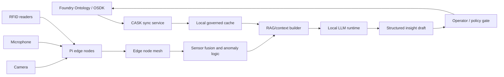

# altiair

Planning and implementation repo for a Palantir CASK edge system that uses Foundry OSDK data, Raspberry Pi sensor nodes, and a local LLM to produce mission-critical insight drafts.

Project lead: Sarah Hatcher.

The current decision brief is here:

- [CASK OSDK and Local LLM Brief](docs/cask-osdk-local-llm-brief.md)

## Goal

Build a local CASK edge layer that can:

- Pull governed mission context from Foundry through the OSDK.
- Ingest camera, microphone, and RFID signals from Pi 4B and Pi 5 nodes.
- Fuse deterministic sensor events before invoking any LLM.
- Use a local non-Chinese model family to draft structured insights with citations.
- Write approved events, insight drafts, node health, and operator decisions back to Foundry.

## Demo Scenario

The demo is an edge-node mesh for a controlled training environment. A group of operators carry or use Pi-backed nodes with RFID readers plus camera and microphone inputs. Those nodes share structured observations with each other, use RFID reads to estimate the location of a tagged training subject or tagged asset, and surface a shared operating picture on a chest-worn or handheld device such as an iPad, phone, or similar field computer.

The CASK-backed omni-model should fuse the sensor streams into a local, evidence-grounded view:

- RFID provides the primary identity/presence signal.
- Camera events provide visual confirmation, movement, zone, and scene context.
- Microphone events provide transcripts, acoustic events, and local context.
- Foundry/OSDK provides governed mission context, asset/person/tag mappings, permissions, and writeback.
- The local LLM explains the fused picture, calls out uncertainty, and recommends non-kinetic coordination steps such as coverage, search, deconfliction, sensor repositioning, and next verification checks.

This repo should not encode instructions for harming, capturing, or attacking a real person. Any "target" language in demos should mean an authorized, tagged training subject or simulated entity.

## Hard Constraints

- No credentials, access details, tokens, client secrets, or private Foundry URLs in git.
- No Chinese-origin model families. Excluded examples include Qwen, DeepSeek, Yi, MiniCPM, Baichuan, ChatGLM, and InternLM.
- LLM output is advisory. Mission-critical actions must stay behind deterministic checks, policy gates, and operator review.
- Raw camera/audio retention must follow policy. Prefer structured detections, transcripts, and redacted references over storing raw media.

## System Sketch

## Workstreams

### Foundry / OSDK

Decide or gather:

- Foundry stack URL, Ontology RID, generated OSDK package name, and package index URL.
- Developer Console app shape for `cask-edge-service`.
- OAuth grant path and service-user permissions.
- Object types for missions, assets, sensors, cameras, microphones, RFID readers, RFID tags, edge nodes, observations, alerts, and tasks.
- Actions/writeback targets for camera events, audio events, RFID events, insight drafts, node health, incident annotations, operator decisions, and action logs.

### Edge Mesh

Decide:

- Pi 4B responsibilities versus Pi 5 hub responsibilities.
- Mesh transport and offline queue behavior.
- Clock sync, node identity, node health, and retry semantics.
- Local cache format and retention policy.
- Broadcast/ping behavior for high-confidence location updates.
- Chest-device display protocol for phones, tablets, or other field computers.

### Sensor Pipeline

Initial event contracts:

- `CameraEvent`: camera ID, detection class, bounding region, confidence, frame time, optional thumbnail reference, retention policy.
- `AudioEvent`: microphone ID, VAD window, transcript, ASR confidence, keyword/acoustic class, optional redacted audio reference.
- `RfidEvent`: reader ID, tag ID, antenna/zone, RSSI if available, read count, timestamp, matched Foundry reference.
- `Anomaly`: deterministic rule ID, threshold, score, related observations.
- `InsightDraft`: LLM explanation, evidence references, confidence, limitations, recommended next check.
- `TrackEstimate`: tracked subject/asset ID, last known zone, confidence, supporting RFID/camera/audio events, freshness, and conflict markers.
- `NodePing`: event notification sent to edge nodes when a track estimate crosses confidence or urgency thresholds.

Processing granularity:

- Each node should extract local events before sending data across the mesh.
- Camera frames should become detections, thumbnails, or short clips only when policy allows.
- Microphone streams should become voice-activity windows, transcripts, and acoustic labels.
- RFID reads should be deduplicated, timestamped, and joined to known tags.
- The hub should reconcile conflicting observations and produce track estimates with freshness and confidence.
- The LLM should consume the compact evidence bundle, not continuous raw sensor streams.

### Local Models

Current shortlist:

- Pi 5 hub default candidate: `ibm-granite/granite-3.3-2b-instruct`.
- Pi 4B/Pi 5 fallback candidate: `meta-llama/Llama-3.2-1B-Instruct`.
- Pi 5 quality candidates: `meta-llama/Llama-3.2-3B-Instruct`, `HuggingFaceTB/SmolLM3-3B`, `microsoft/Phi-4-mini-instruct`.
- Microphone/ASR candidates: Whisper tiny/base/small via `whisper.cpp`, or IBM Granite Speech after hardware benchmarking.
- Retrieval candidates: `google/embeddinggemma-300m`, `nomic-ai/nomic-embed-text-v1.5`, or IBM Granite embeddings.

## Proposal Slots

Use pull requests to update these sections as people bring ideas:

- Proposed Foundry Ontology objects/actions:
- Proposed CASK deployment topology:
- Proposed Pi hardware split:
- Proposed mesh transport:
- Proposed model/runtime stack:
- Proposed retention and security policy:
- Proposed evaluation prompts and metrics:

Each proposal should include:

- What decision it changes.
- Why it is better for mission reliability.
- Hardware/runtime assumptions.
- Data/security impact.
- How we can test it on Pi 4B and Pi 5.

## Immediate Next Steps

1. Confirm CASK-specific docs or in-platform guidance available in Foundry.
2. Create or identify the `cask-edge-service` Developer Console application.
3. Export the first OSDK package for the minimum object/action set.
4. Build a synthetic sensor-event fixture for camera, microphone, and RFID.
5. Benchmark the first local model pair on actual Pi 4B and Pi 5 hardware.
6. Define the first structured `InsightDraft` JSON schema and acceptance tests.
