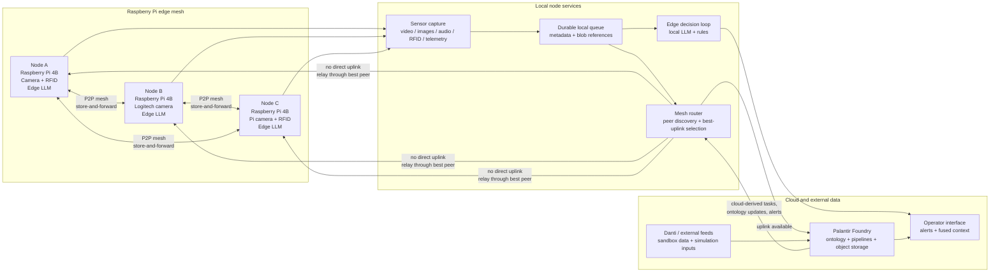
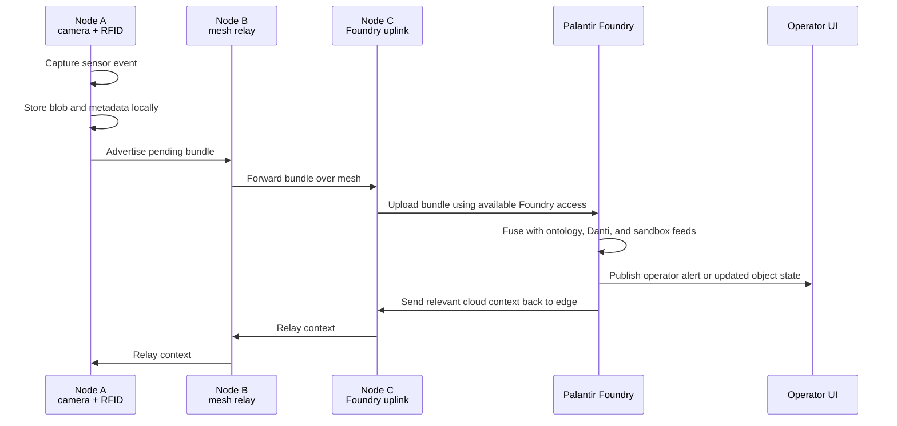
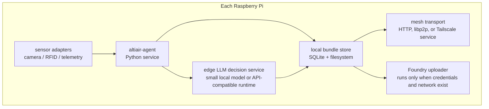

# Altiair

Altiair is a hackathon prototype for resilient edge sensing in unreliable network environments. Raspberry Pi nodes form a peer-to-peer mesh, collect sensor data, and forward video, image, audio, RFID, and other telemetry through whichever node currently has the best cloud path. If any node can reach Palantir Foundry, the rest of the mesh can daisy chain through it to synchronize data and receive cloud-enriched operator updates.

## Architecture



## Daisy Chain Upload Path



## Hackathon Hardware

| Quantity | Equipment | Role |
| --- | --- | --- |
| 3 | Raspberry Pi 4B with power supplies and Raspberry Pi OS | Mesh nodes, sensor ingest, local inference, relay routing |
| 1 | Logitech USB camera | Video/image capture on one node |
| 1 | Raspberry Pi camera sensor | Video/image capture on one node |
| 1+ | RFID sensors | Local identity, asset, or checkpoint events |

## One-Day Build Plan

1. **Prepare the Pis**
   - Flash or verify Raspberry Pi OS on all three devices.
   - Set hostnames such as `altiair-node-a`, `altiair-node-b`, and `altiair-node-c`.
   - Enable SSH, camera support, and required interfaces for RFID hardware.
   - Install Python, Docker or systemd services, camera utilities, and networking tools.

2. **Create the peer-to-peer mesh**
   - Use Wi-Fi ad hoc, Wi-Fi Direct, Tailscale, or libp2p depending on network constraints.
   - Each node should advertise:
     - node id
     - reachable peer addresses
     - battery/power status if available
     - current internet quality
     - Foundry upload capability
   - Start with a simple heartbeat and peer table before adding automatic routing.

3. **Capture sensor bundles**
   - Normalize each event into a bundle:
     - `metadata.json`
     - optional `image.jpg`
     - optional `video.mp4`
     - optional `audio.wav`
     - optional `rfid.json`
     - optional `telemetry.json`
   - Store bundles locally until acknowledged by Foundry.
   - Include timestamps, node id, sensor type, geolocation if available, and confidence.

4. **Route through the best uplink**
   - Score each node by cloud reachability, bandwidth, latency, and recent upload success.
   - If a node cannot reach Foundry, it forwards bundles to the best peer.
   - The selected uplink node uploads to Foundry and returns acknowledgement receipts through the mesh.

5. **Fuse with Foundry, sandbox data, and Danti**
   - Upload edge bundles into a Foundry dataset or object-backed ingestion path.
   - Map events into ontology objects such as `SensorObservation`, `Asset`, `Track`, `Alert`, and `Location`.
   - Join with Foundry sandbox and Danti-derived simulation data to create demo scenarios.

6. **Add the operator interface**
   - Show mesh health, active nodes, pending uploads, recent observations, and generated alerts.
   - Highlight which node is acting as the current Foundry gateway.
   - Provide concise decision support from edge LLM outputs and cloud ontology context.

## Suggested Prototype Components



Recommended first-pass implementation:

- **Language:** Python for fast hardware integration.
- **Node service:** FastAPI or Flask for peer endpoints and local status.
- **Local storage:** SQLite for bundle metadata, filesystem for media blobs.
- **Peer transport:** HTTP between known peers for day-one reliability; swap to libp2p after the demo path works.
- **Camera capture:** `libcamera` for Pi camera, OpenCV or `ffmpeg` for Logitech USB camera.
- **RFID ingest:** Python RFID library matched to the available sensor module.
- **Uploader:** Foundry SDK, Foundry REST API, or a sandbox upload endpoint depending on available credentials.
- **Edge LLM:** small local model runtime when feasible; otherwise mock the interface with deterministic rules for the demo.

## Demo Scenario

1. Node A captures a camera frame or RFID event while disconnected from the internet.
2. Node A stores the bundle locally and announces it to peers.
3. Node C has the best internet path and Foundry access.
4. Node A forwards the bundle through Node B or directly to Node C.
5. Node C uploads the bundle to Foundry.
6. Foundry fuses the observation with sandbox and Danti data.
7. The operator UI receives an alert such as:
   - inbound aerial object detected near a protected area
   - unknown vehicle track approaching a checkpoint
   - cloud feed indicates a hazard near the current operating location
8. The edge mesh receives the relevant cloud context so disconnected operators still get the latest actionable state when a peer reconnects.

## Data Flow Contract

```json
{
  "bundle_id": "node-a-20260502T120000Z-0001",
  "node_id": "altiair-node-a",
  "captured_at": "2026-05-02T12:00:00Z",
  "sensor_type": "camera",
  "media": [
    {
      "type": "image",
      "path": "image.jpg",
      "sha256": "..."
    }
  ],
  "rfid": null,
  "telemetry": {
    "lat": null,
    "lon": null,
    "network_quality": "offline"
  },
  "edge_assessment": {
    "summary": "motion detected near checkpoint",
    "confidence": 0.72,
    "recommended_action": "review"
  },
  "upload": {
    "status": "pending",
    "preferred_gateway": "altiair-node-c"
  }
}
```

## Success Criteria

- Three Raspberry Pis can discover or reach each other on a local mesh.
- At least one Pi captures real camera or RFID data.
- A disconnected Pi can pass a sensor bundle to another Pi.
- The best-connected Pi can upload or simulate upload into Foundry.
- The UI shows node status, pending bundles, uploaded bundles, and fused alerts.
- Edge LLM or rule-based fallback produces a decision-support summary from sensor data.
