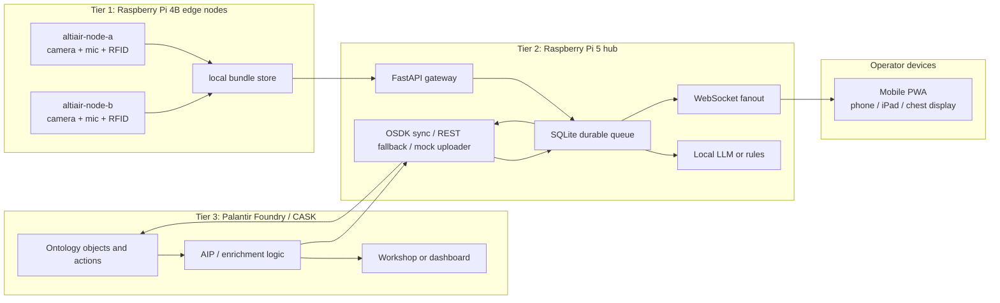

# Altiair

Hackathon planning and implementation repo for a Palantir CASK edge system that uses Foundry OSDK data, Raspberry Pi sensor nodes, and a local LLM to produce evidence-grounded mission insight drafts in unreliable network environments.

Project lead: Sarah Hatcher.

Team inputs merged here:

- Sarah/Codex CASK OSDK + local LLM plan.
- `origin/main` edge mesh and iPad operator README.
- `readme-ben.md` hackathon execution draft.

The current decision brief is here:

- [CASK OSDK and Local LLM Brief](docs/cask-osdk-local-llm-brief.md)

Shared data ideas and LLM context drop:

- [National Security Hackathon - Altiair shared Google Drive](https://drive.google.com/drive/folders/1hRTFxmv2g1PxKLg1U8fvUuWTxWWHIGql?usp=sharing)

Use the Drive for team data ideas, mock fixtures, diagrams, sensor notes, evaluation prompts, and context documents we may later ingest into a local RAG/LLM context pipeline. Do not upload credentials, private Foundry URLs, client secrets, uncontrolled raw media, or sensitive personal data.

## Merged Source Insights

What all three README drafts agree on:

- The core product is resilient edge sensing for DDIL or unreliable network environments.
- Raspberry Pis collect camera, microphone, RFID, and telemetry events.
- Local state must keep working when cloud connectivity drops.
- Foundry/CASK provides governed mission context, ontology mapping, enrichment, and writeback.
- A local LLM or deterministic fallback produces structured operator-facing summaries.
- A phone, iPad, or chest-worn device shows node health, observations, alerts, and fused context.
- Human review stays in the loop for any consequential output.

What differed across the drafts, and the merged decision:

| Topic | Difference | Merged direction |
| --- | --- | --- |
| Project spelling | Ben's draft says `Altair`; repo, Drive, and PR use `Altiair`. | Keep `Altiair` unless the full team renames the repo and shared assets. |
| Hardware | One draft assumed 3x Pi 4B; Sarah confirmed 2x Pi 4B and 1x Pi 5. | Use 2x Pi 4B edge nodes and 1x Pi 5 hub candidate. |
| Topology | One draft used peer mesh; Ben's draft used Pi 5 hub + phones on a local LAN. | MVP uses Pi 5 as hub/gateway on a local LAN, with Pi 4B nodes doing edge capture and store-and-forward. Peer-to-peer mesh remains a stretch path. |
| Foundry integration | Sarah's plan targets OSDK; Ben's draft says raw REST for v1. | OSDK is the target CASK path. REST/mock uploader is allowed as a day-one fallback if OSDK setup blocks the demo. |
| Operator UI | Drafts mention iPad, phones, and PWA. | Build a mobile PWA first so phone, iPad, or chest computer can use the same gateway UI. Native iPad can be a follow-on. |
| LLM default | Drafts mention Granite, Llama, Gemma, Phi, and SmolLM. | Benchmark non-Chinese small models on Pi 5 first; use deterministic rules if latency misses the demo window. |
| Scope | Ben's draft explicitly excludes kill-chain automation; Sarah's plan narrows target language. | The demo uses authorized tagged training subjects or simulated entities only. Outputs are advisory and non-kinetic. |

Open decisions:

- Final project spelling: `Altiair` versus `Altair`.
- Whether the first Foundry path is generated OSDK, REST, or mock uploader.
- Which model wins on Pi 5 latency and JSON reliability.
- Whether the demo UI is phone-first PWA only or includes iPad-specific layout polish.
- Which CASK kit capabilities are available during the hackathon.

## Goal

Build a local CASK edge layer that can:

- Pull governed mission context from Foundry through the OSDK.
- Ingest camera, microphone, and RFID signals from Pi 4B and Pi 5 nodes.
- Mock provider-style LTE/RF location telemetry using the Arduino RFID kit.
- Fuse deterministic sensor events before invoking any LLM.
- Use a local non-Chinese model family to draft structured insights with citations.
- Broadcast high-confidence evidence updates to edge nodes and operator devices.
- Write approved events, insight drafts, node health, and operator decisions back to Foundry.

## Demo Scenario

The demo is an edge-node mesh for a controlled training environment. Operators carry or use Pi-backed nodes with RFID readers plus camera and microphone inputs. Those nodes share structured observations with each other, use RFID reads to estimate the location of a tagged training subject or tagged asset, and surface a shared operating picture on a chest-worn or handheld device such as a phone, iPad, or similar field computer.

The real-world pattern being mocked is provider-style RF/LTE location telemetry: an external network can report a location estimate for a device or tag. For this demo, we do not have carrier-grade granularity. We will use an Arduino RFID kit to generate structurally similar location events, then mark them with explicit source, precision, confidence, freshness, and mock status fields.

The CASK-backed omni-model should fuse the sensor streams into a local, evidence-grounded view:

- RFID provides the primary identity or presence signal.
- Mock provider-style location events provide the LTE/RF location shape we expect CASK to consume later.
- Camera events provide visual confirmation, movement, zone, and scene context.
- Microphone events provide transcripts, acoustic events, and local context.
- Foundry/OSDK provides governed mission context, asset/person/tag mappings, permissions, and writeback.
- The local LLM explains the fused picture, calls out uncertainty, and recommends non-kinetic coordination steps such as coverage, search, deconfliction, sensor repositioning, and next verification checks.

This repo should not encode instructions for harming, capturing, or attacking a real person. Any "target" language in demos should mean an authorized, tagged training subject or simulated entity.

## Hardware Inventory

Confirmed demo hardware:

| Quantity | Equipment | Role |
| --- | --- | --- |
| 2 | Raspberry Pi 4 Model B | Edge sensor nodes for camera, microphone, RFID, local event extraction, and store-and-forward. |
| 1 | Raspberry Pi 5 | Hub candidate for FastAPI gateway, SQLite queue, local LLM runtime, WebSocket fanout, and Foundry/CASK sync. |
| 1+ | Arduino RFID kit / RFID readers | Mock provider-style location and tag presence events. |
| 1+ | Camera inputs | Visual observations through Pi camera or USB camera. |
| 1+ | Microphone inputs | Voice activity, transcript, acoustic event, or note capture. |
| 1+ | Phone, iPad, or chest computer | Operator display through mobile PWA. |
| 1 | Travel router or local AP | Closed LAN for phones and Pis; AP isolation must be off. |

## MVP Architecture



Recommended day-one topology:

- Closed LAN through a travel router with AP isolation off.
- `altiair-node-a` and `altiair-node-b` are Pi 4B edge nodes.
- `altiair-hub` is the Pi 5 gateway and local LLM host.
- Phones and iPads connect only to the local LAN for the demo.
- Use `mkcert` or equivalent local TLS if mobile browsers need camera or microphone access.
- Use static peer configuration first; automatic discovery, libp2p, Wi-Fi Direct, or MANET behavior are stretch goals.

## Workstreams

| Lane | Owner | Owns | First output |
| --- | --- | --- | --- |
| Backend / Pi | TBD | `pi/` | FastAPI scaffold, healthcheck, SQLite queue, bundle API. |
| Frontend / PWA | TBD | `web/` | Mobile PWA shell, service worker, reconnecting WebSocket client. |
| Foundry / CASK / OSDK | Sarah / Rob lead | `foundry/` | Ontology sketch, OSDK package path, REST/mock fallback. |
| Sensor pipeline | TBD | `sensors/` | Camera, microphone, RFID adapters emitting normalized events. |
| Networking + demo | Ben lead | `demo/` | Router config, local TLS, smoke test, rehearsal script. |

### Backend / Pi

- FastAPI service with `GET /health`.
- SQLite metadata store plus filesystem blob references.
- Bundle state machine: `pending`, `forwarded`, `uploading`, `uploaded`, `failed`.
- WebSocket fanout to operator UI.
- Deterministic fusion rules before LLM invocation.
- Ollama or llama.cpp-compatible local model runtime when latency allows.

### Frontend / PWA

- Mobile-first PWA that works on Android Chrome, iPad, or phone browser.
- Mesh health view: nodes online, hub/gateway, peer quality, pending upload counts.
- Observation feed: timestamp, source node, sensor type, media preview, upload status.
- Map or zone view with pre-cached tiles if map time permits.
- Alert/detail pane with evidence, uncertainty, and acknowledgement action.
- Degraded/offline state when Foundry is unreachable but local mesh data is still available.

### Foundry / CASK / OSDK

Decide or gather:

- Foundry stack URL, Ontology RID, generated OSDK package name, and package index URL.
- Developer Console app shape for `cask-edge-service`.
- OAuth grant path and service-user permissions.
- Object types for missions, assets, sensors, cameras, microphones, RFID readers, RFID tags, location feeds, edge nodes, observations, alerts, and tasks.
- Actions/writeback targets for camera events, audio events, RFID events, mock provider location events, insight drafts, node health, incident annotations, operator decisions, and action logs.

Day-one fallback:

- If OSDK setup blocks the demo, use a narrow REST or mock uploader behind the same local endpoint.
- Keep the integration boundary stable: `POST /foundry/upload` returns deterministic acknowledgement receipts.

### Sensor Pipeline

Initial event contracts:

- `CameraEvent`: camera ID, detection class, bounding region, confidence, frame time, optional thumbnail reference, retention policy.
- `AudioEvent`: microphone ID, VAD window, transcript, ASR confidence, keyword/acoustic class, optional redacted audio reference.
- `RfidEvent`: reader ID, tag ID, antenna/zone, RSSI if available, read count, timestamp, matched Foundry reference.
- `MockProviderLocationEvent`: simulated LTE/RF-provider-style location fix generated from the Arduino RFID kit, with source type, mock flag, zone/coordinate, precision radius, confidence, and freshness.
- `LocationFix`: normalized location estimate from RFID, mock provider telemetry, camera, microphone, or manual input.
- `Anomaly`: deterministic rule ID, threshold, score, related observations.
- `InsightDraft`: LLM explanation, evidence references, confidence, limitations, recommended next check.
- `TrackEstimate`: tracked subject/asset ID, last known zone, confidence, supporting RFID/camera/audio events, freshness, and conflict markers.
- `NodePing`: event notification sent to edge nodes when a track estimate crosses confidence or urgency thresholds.

Processing granularity:

- Each node extracts local events before sending data across the mesh.
- Camera frames become detections, thumbnails, or short clips only when policy allows.
- Microphone streams become voice-activity windows, transcripts, and acoustic labels.
- RFID reads are deduplicated, timestamped, and joined to known tags.
- Arduino RFID reads also emit mock provider-style location events so downstream CASK logic can use the shape of future LTE/RF location telemetry.
- All location estimates must carry `source`, `precision`, `confidence`, `freshness`, and `isMock` fields.
- The hub reconciles conflicting observations and produces track estimates with freshness and confidence.
- The LLM consumes compact evidence bundles, not continuous raw sensor streams.

## Node API Contract

Every node or gateway should expose the same minimal API so workstreams can integrate quickly:

| Endpoint | Purpose |
| --- | --- |
| `GET /health` | Returns node id, uptime, service status, and local clock. |
| `GET /peers` | Returns known peers and last heartbeat status. |
| `GET /gateway` | Returns current gateway candidate and score. |
| `POST /bundles` | Receives a sensor bundle from local capture or another Pi. |
| `GET /bundles/pending` | Lists bundles that still need forwarding or upload. |
| `POST /bundles/{bundle_id}/ack` | Records Foundry upload acknowledgement. |
| `POST /foundry/upload` | Uploads a bundle when this node is the selected gateway. |
| `GET /observations` | Returns recent local, forwarded, and uploaded sensor observations for the PWA. |
| `GET /alerts` | Returns edge-generated and Foundry-enriched alerts for the PWA. |
| `POST /alerts/{alert_id}/ack` | Records operator acknowledgement from the PWA. |

Example bundle:

```json
{
  "bundle_id": "altiair-node-a-20260502T120000Z-0001",
  "node_id": "altiair-node-a",
  "captured_at": "2026-05-02T12:00:00Z",
  "sensor_type": "rfid",
  "media": [],
  "rfid": {
    "reader_id": "rfid-a",
    "tag_id": "training-subject-001",
    "zone": "checkpoint-alpha",
    "read_count": 3
  },
  "location_fix": {
    "source": "mock_provider_rfid",
    "isMock": true,
    "zone": "checkpoint-alpha",
    "precision_m": 25,
    "confidence": 0.71,
    "freshness_s": 4
  },
  "edge_assessment": {
    "summary": "Tagged training subject likely near checkpoint alpha.",
    "confidence": 0.71,
    "recommended_next_check": "Verify with nearest camera or second RFID read."
  },
  "upload": {
    "status": "pending",
    "preferred_gateway": "altiair-hub"
  }
}
```

## Local Models

Hard rule: no Chinese-origin model families. Excluded examples include Qwen, DeepSeek, Yi, MiniCPM, Baichuan, ChatGLM, and InternLM.

Benchmark candidates:

- Pi 5 low-latency candidate: `google/gemma-3-1b-it` or Ollama `gemma3:1b` if available locally.
- Pi 5 quality candidate: `ibm-granite/granite-3.3-2b-instruct`.
- Pi 4B/Pi 5 fallback candidate: `meta-llama/Llama-3.2-1B-Instruct`.
- Pi 5 quality alternatives: `meta-llama/Llama-3.2-3B-Instruct`, `HuggingFaceTB/SmolLM3-3B`, `microsoft/Phi-4-mini-instruct`.
- Microphone/ASR candidates: Whisper tiny/base/small via `whisper.cpp`, or IBM Granite Speech after hardware benchmarking.
- Retrieval candidates: `google/embeddinggemma-300m`, `nomic-ai/nomic-embed-text-v1.5`, or IBM Granite embeddings.

Output constraints:

- Prefer schema-constrained JSON for extraction.
- Cite source bundle IDs, Foundry object IDs, or Drive context documents.
- Always include uncertainty and next verification checks.
- Never emit autonomous tactical action instructions.

## One-Day Build Plan

1. Prepare the Pis.
   - Verify Raspberry Pi OS on both Pi 4B nodes and the Pi 5.
   - Set hostnames: `altiair-node-a`, `altiair-node-b`, and `altiair-hub`.
   - Enable SSH, camera support, microphone access, and RFID interfaces.
   - Install Python, FastAPI runtime, SQLite tooling, camera utilities, and networking tools.

2. Bring up the local LAN.
   - Configure travel router with AP isolation off.
   - Connect both Pi 4B nodes, Pi 5, and operator phones/tablets.
   - Add static peer config if discovery takes too long.
   - Verify `GET /health` and `GET /peers` across devices.

3. Capture sensor bundles.
   - Normalize camera, microphone, RFID, and mock provider location events.
   - Store bundle metadata in SQLite and blobs on disk.
   - Include timestamps, node id, sensor type, retention policy, and confidence.

4. Route through the hub or best uplink.
   - Use Pi 5 as default gateway for the MVP.
   - Score alternate gateways by reachability, recent upload success, latency, and queue depth.
   - Return upload acknowledgements to the originating node.

5. Wire Foundry/CASK.
   - Try OSDK first if package, OAuth, and object/action details are ready.
   - Use REST/mock uploader if OSDK setup blocks the demo.
   - Map events into objects such as `SensorObservation`, `Asset`, `TrackEstimate`, `Alert`, `LocationFix`, and `NodeHealth`.

6. Build the PWA operator view.
   - Show node health, observations, location estimates, and insight drafts.
   - Add WebSocket reconnect and offline/degraded state.
   - Add acknowledgement action for alerts and drafts.

7. Rehearse the demo.
   - Show local-only operation.
   - Show RFID/camera/microphone event capture.
   - Show a fused insight draft with evidence and uncertainty.
   - Show cloud/CASK sync or deterministic mock acknowledgement.
   - Show recovery after a node or phone disconnects.

## Hackathon Checkpoints

| Time | Outcome |
| --- | --- |
| Saturday, May 2, 2026, 12:30 PM | Lanes locked, router plan selected, Foundry/CASK status known. |
| Saturday, May 2, 2026, 4:00 PM | Each lane shows a 30-second working clip or CLI trace. |
| Saturday, May 2, 2026, 9:00 PM | MVP cut: phones/tablets + Pi hub end-to-end works and is submittable. |
| Sunday, May 3, 2026, 2:00 AM | Hard stop for risky new scope. |
| Sunday, May 3, 2026, 9:00 AM | Three rehearsals under the target pitch time. |
| Sunday, May 3, 2026, 11:45 AM | Submission ready. |

## Demo Beats

1. Phones/tablets and Pi 5 are visible on the local LAN.
2. Operator devices are on local Wi-Fi only.
3. Pi 4B node captures RFID plus camera or microphone event.
4. Pi 5 hub receives the bundle, fuses deterministic evidence, and drafts a structured insight.
5. PWA updates on all connected operator devices.
6. If Foundry/CASK is online, the hub syncs and receives acknowledgement or enrichment.
7. If the cloud or one operator device drops, local devices continue showing cached mesh state and new local events.
8. When connectivity returns, queued events reconcile.

## Shared Context / Drive Intake

The shared Google Drive is the working drop for everyone's data ideas. For anything intended to become LLM context, include enough metadata for later ingestion:

- Title and owner.
- Source type: mock data, sensor note, Foundry idea, architecture note, evaluation prompt, UI idea, or policy constraint.
- Whether the content is real, synthetic, mocked, or speculative.
- Sensitivity and retention expectation.
- Related sensor/event types, if known.
- Short summary of how it should affect the CASK demo.

The RAG ingestion path should only consume cleared material and should preserve source attribution so generated insight drafts can cite the relevant Drive document, Foundry object, or sensor event.

## Hard Constraints

- No credentials, access details, tokens, client secrets, or private Foundry URLs in git.
- No Chinese-origin model families.
- LLM output is advisory. Mission-critical actions must stay behind deterministic checks, policy gates, and operator review.
- Raw camera/audio retention must follow policy. Prefer structured detections, transcripts, and redacted references over storing raw media.
- No kill-chain automation. Human review is required for every consequential output.
- No drone swarm coordination, offensive cyber, RF jamming detection, or adversary spoofing in the MVP.
- No hidden dependency on internet access for the local demo path.

## Proposal Slots

Use pull requests to update these sections as people bring ideas:

- Proposed Foundry Ontology objects/actions:
- Proposed CASK deployment topology:
- Proposed Pi hardware split:
- Proposed mesh transport:
- Proposed model/runtime stack:
- Proposed retention and security policy:
- Proposed shared Drive context corpus:
- Proposed evaluation prompts and metrics:

Each proposal should include:

- What decision it changes.
- Why it is better for mission reliability.
- Hardware/runtime assumptions.
- Data/security impact.
- How we can test it on Pi 4B and Pi 5.

## Immediate Next Steps

1. Confirm CASK-specific docs or in-platform guidance available in Foundry.
2. Create or identify the `cask-edge-service` Developer Console application.
3. Export the first OSDK package for the minimum object/action set, or define the REST/mock fallback route.
4. Scaffold `pi/`, `web/`, `foundry/`, `sensors/`, and `demo/` folders.
5. Build a synthetic sensor-event fixture for camera, microphone, RFID, and mock provider location telemetry.
6. Seed the shared Drive with team data ideas and context candidates using the intake convention above.
7. Benchmark the first local model pair on the two Pi 4 Model B nodes and one Pi 5.
8. Define the first structured `InsightDraft` JSON schema and acceptance tests.
