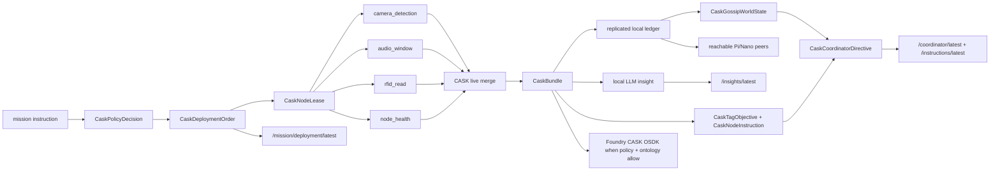

# CASK Ontology Approach

`CASK` is the Foundry-shaped mission data ontology for this build. The local Pi/Nano runtime should treat every live sensor packet, local LLM output, tag-plan assignment, and Foundry writeback as an instance of that ontology, even when the node is offline and only has the replicated local ledger.

The implementation uses three layers:

1. **Live adapter events** from camera, microphone, RFID, and node health processes.
2. **Local CASK bundle records** in `src/cask/types.ts`, produced by `src/sensors/liveMerge.ts`.
3. **Foundry CASK ontology objects/actions**, described in `src/cask/ontology.ts` and printed with `npm run cask:ontology`.

## Ontology Objects

The target CASK ontology shape is:

| Object | Purpose |
| --- | --- |
| `CaskMission` | Mission/exercise context and policy state. |
| `CaskMissionInstruction` | Operator-provided mission instruction packet that seeds deployment. |
| `CaskPolicyDecision` | Deployability, review state, allowed actions, and rejected actions. |
| `CaskDeploymentOrder` | Policy-gated order mapping the mission instruction onto Pi/Jetson node leases. |
| `CaskNodeLease` | Short-lived role lease for sensing, display, relay, gateway, and coordinator-candidate duties. |
| `CaskMissionTimelineEvent` | Auditable instruction, policy, lease, activation, and blocked-deployment timeline. |
| `CaskEdgeNode` | Pi 4B, Pi 5, Jetson, and display node metadata. |
| `CaskSensorObservation` | Normalized camera, audio, RFID, or provider-style location events. |
| `CaskLocationFix` | Coarse RFID/provider-style location fixes with precision radius and freshness. |
| `CaskUasObservation` | Drone-class observations from camera inference or allowed imported context. |
| `CaskControlSourceEstimate` | Evidence-backed estimate that correlates UAS observation and coarse location context. |
| `CaskCounterUasCue` | Policy-gated cue for human review and verification. |
| `CaskTagObjective` | Non-contact training tag objective state. |
| `CaskNodeInstruction` | Per-node instruction, role, fallback nodes, and evidence IDs. |
| `CaskGossipWorldState` | Gossip-derived shared awareness snapshot: online nodes, failed nodes, evidence IDs, and queue/load hints. |
| `CaskCoordinatorDirective` | Raft-term singleton coordinator output with leader ID, authority state, recommended action, and per-node instruction map. |
| `CaskInsightDraft` | Local LLM draft with citations, limitations, and policy state. |
| `CaskNodeHealth` | Node health, queue depth, Foundry reachability, and local model status. |

## Action Names

When the Foundry ontology is expanded past the current `[Example] CASK GPS Position` smoke path, the generated OSDK should expose actions matching these names or env overrides should map to the actual generated names:

```text
createCaskMissionInstruction
createCaskPolicyDecision
createCaskDeploymentOrder
upsertCaskNodeLease
createCaskMissionTimelineEvent
createCaskSensorObservation
createCaskLocationFix
createCaskUasObservation
createCaskControlSourceEstimate
createCaskCounterUasCue
createCaskTagObjective
upsertCaskNodeInstruction
createCaskGossipWorldState
createCaskCoordinatorDirective
createCaskInsightDraft
upsertCaskNodeHealth
```

The current live Foundry connection is already validated for the narrow `createExampleCaskGpsPosition` action. Full bundle writeback should stay queued locally until the CASK actions above exist in the ontology and are added to the Developer Console OSDK resource scope.

## Runtime Flow



Every Pi and the Jetson can run `POST /sensor-events`, `GET /gossip/world`, `GET /coordinator/latest`, and `GET /instructions/latest`. The Pi 5 hub is the preferred CASK/Foundry gateway, and the Jetson is the secondary gateway, but the local CASK ledger, gossip world, tag-plan records, and coordinator directives replicate to every reachable node. Each node also runs its own local LLM insight path; Gemma is the default approved model family for the Pi starter profile, with Ollama mode enabled once the model runtime is installed. The coordinator LLM is singleton per Raft-style term: local fusion can run everywhere, but only the elected leader publishes coordinator directives. Election favors the best connected or best positioned viable node using link/load/model/role state plus current evidence and task ownership.

Foundry is not a live dependency for the decentralized path. When connected, a gateway can use `GET /foundry/intelligence?refresh=true` to pull governed mission, zone, policy, tag, and object context through the OSDK. That context is cached into the local CASK ledger for DDIL use, cited by the local LLM where relevant, and paired with queued writeback so what happened can be sent back up to the commander when connectivity returns.

## Mission Instruction Deployment

The operator/frontend can seed the demo with one CASK-shaped instruction:

```bash
curl -X POST http://127.0.0.1:8080/mission/deploy \
  -H 'content-type: application/json' \
  --data '{
    "title": "CASK controlled training tag",
    "missionText": "Deploy the Pi and Jetson CASK mesh to collect RFID, microphone, camera, and node-health evidence for a controlled training tag in training-zone-alpha.",
    "objectiveType": "controlled_training_tag",
    "authorizedZoneId": "training-zone-alpha",
    "subjectRef": "training-tag-001",
    "operatorAuthorized": true,
    "requestedBy": "Sarah Hatcher"
  }'
```

The runtime returns a `CaskDeploymentOrder` with one `CaskNodeLease` per node:

- `altiair-hub`: mission LAN/display, Foundry gateway queue, coordinator candidate.
- `altiair-node-a`: RFID reader/proximity ingest plus fallback relay.
- `altiair-node-b`: microphone/audio-window ingest plus fallback relay.
- `altiair-orin`: camera inference, accelerated local model work, secondary gateway, fallback relay.

Every lease includes the node API base URL, startup command, required endpoints, sensor event kinds, fallback node IDs, and policy state. Harmful or operational attack wording sets `policyState=blocked` and prevents lease creation.

## Instruction Boundary

The tag objective is explicitly a **non-contact training tag** flow. The local LLM and tag planner may produce approach/checkpoint guidance, relay/display roles, safety observation, and verification tasks. They must not produce harm, capture, pursuit, engagement, autonomous action, or target prosecution instructions.

For the demo, the mission-critical behavior is:

- preserve evidence and instructions when a node goes down;
- assign each node a bounded local role;
- keep confidence, freshness, policy state, and evidence IDs visible;
- require human authorization before the tag objective changes from standby to ready;
- sync to Foundry CASK when the gateway has network and matching ontology actions.
