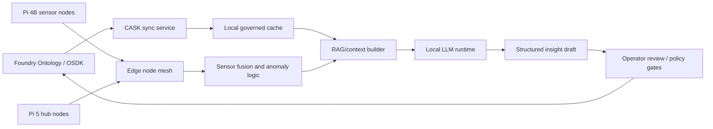

# CASK OSDK and Local LLM Brief

Date: 2026-05-02

## Working Assumptions

- CASK means Palantir's CASK capability, with Foundry as the governed source of mission data.
- Raspberry Pi hardware includes Pi 4B nodes and Pi 5 nodes.
- No Chinese-origin model families should be used. Excluded examples: Qwen, DeepSeek, Yi, MiniCPM, Baichuan, ChatGLM, InternLM.
- The local LLM is advisory. It should produce structured insight drafts with evidence, confidence, and limitations; it should not be the only control path for mission-critical decisions.

## Architecture Shape

The edge path should be deterministic before it is generative: validate telemetry, normalize units, calculate thresholds and anomaly scores, then ask the LLM to explain and prioritize what the deterministic layer already surfaced.

## Foundry OSDK Information To Gather

Create or identify two Developer Console applications:

- `cask-edge-service`: backend service / confidential OAuth client for the Pi-side daemon. This service should use a service user and scoped access to only the Ontology resources needed for sync and writeback.
- `cask-operator-console`: optional client-facing React application. This must not store client secrets. If hosted on Foundry, it is static SPA hosting only.

Required values from Foundry:

- Foundry stack URL.
- Ontology RID.
- Generated OSDK package name and package index URL.
- Application type and OAuth grant path for the edge service.
- Client ID and secret delivery path for the Pi, stored outside git.
- Object types to read: missions, assets, sensors, cameras, microphones, RFID readers, RFID tags, edge nodes, observations, alerts, tasks, relevant reference data.
- Object/action types to write: camera events, transcript/audio events, RFID scan events, insight drafts, node health, incident annotations, operator decisions, action logs.
- Functions or AIP Logic functions to call, if any.
- Markings, roles, organizations, and service-user access for all objects.
- Application maximum scope and requested operation scopes, especially Ontology read/write.

Recommended local schema boundary:

- `Observation`: raw or normalized sensor event with source node, timestamp, unit, value, quality, and Foundry object references.
- `CameraEvent`: frame-derived observation with camera ID, detected class, bounding region, confidence, frame time, optional thumbnail reference, and retention policy.
- `AudioEvent`: microphone-derived observation with VAD window, transcript text, ASR confidence, detected keywords/classes, and optional redacted audio reference.
- `RfidEvent`: reader-derived observation with reader ID, tag ID, antenna/zone, RSSI if available, read count, timestamp, and matched Foundry asset/person reference.
- `Anomaly`: deterministic finding with rule ID, score, threshold, and related observations.
- `InsightDraft`: LLM-authored explanation with citations to observations and Foundry object IDs.
- `NodeHealth`: Pi status, mesh connectivity, clock drift, queue depth, model/runtime status.

## Sensor Input Strategy

Camera:

- Prefer local computer vision and frame sampling before invoking the LLM.
- Store structured detections first; store raw frames or clips only when policy and retention rules allow it.
- For Pi 5 with AI HAT+ or AI Camera, use hardware-accelerated object detection where available.
- For LLM context, pass a compact event bundle: detections, timestamps, confidence, location, related RFID/audio events, and Foundry object references.

Microphone:

- Run voice activity detection before ASR to reduce load.
- Convert audio to timestamped transcripts or acoustic event labels before handing context to the LLM.
- Keep raw audio local by default; write transcripts, confidence, and redaction status back to Foundry when allowed.
- Non-Chinese ASR candidates: Whisper tiny/base/small via `whisper.cpp` for Pi-class devices, or IBM Granite Speech on stronger Pi 5/local hub hardware after benchmarking.

RFID readers:

- Treat RFID as the most deterministic identity/presence signal.
- Normalize reads into `RfidEvent` records and join them against Foundry asset/person/tag objects.
- Use RFID to ground camera/audio ambiguity, for example "asset likely present in zone" rather than relying on vision alone.
- Track reader health, duplicate reads, missed-read windows, and tag-reader topology as separate operational signals.

## Pi Hardware Strategy

Pi 4B:

- Treat as sensor and preprocessing nodes first.
- Run telemetry validation, compression, batching, and small deterministic models.
- Only run a tiny LLM if the device is an 8 GB Pi 4B and latency is not mission-critical.

Pi 5:

- Treat as the CASK edge hub.
- Run the local cache, retrieval, insight generation, and writeback queue.
- Prefer quantized models through `llama.cpp` or Ollama-style local APIs.
- If using Raspberry Pi AI HAT+ 2, evaluate the Hailo Ollama server model list and keep only non-Chinese-origin options.

## Non-Chinese Local LLM Shortlist

Primary candidates:

- `ibm-granite/granite-3.3-2b-instruct`: Apache 2.0, 2B parameters, 128K context, RAG and function-calling oriented. Good first Pi 5 candidate.
- `meta-llama/Llama-3.2-1B-Instruct`: practical baseline for Pi 4B/Pi 5, especially in 4-bit GGUF form. Use for concise classification, rewriting, and small summaries.
- `meta-llama/Llama-3.2-3B-Instruct`: better quality than 1B, likely Pi 5 hub only.
- `HuggingFaceTB/SmolLM3-3B`: Apache 2.0, 3B, long context, tool-calling support. Good Pi 5 candidate if quantized performance is acceptable.
- `microsoft/Phi-4-mini-instruct`: 3.8B, 128K context, strong reasoning focus. Evaluate on Pi 5 with enough RAM or on a stronger local hub.

Secondary candidates:

- `google/gemma-3-1b-it` or Gemma 3 270M: best for Pi 4B-class very small local tasks.
- `google/gemma-4-E2B-it`: attractive for multimodal/audio-aware CASK use, but treat as Pi 5-plus or local server class until measured on target hardware.

Embedding/RAG candidates:

- `google/embeddinggemma-300m`: 300M parameter on-device embedding model, strong default for local retrieval if Gemma license terms are acceptable.
- `nomic-ai/nomic-embed-text-v1.5`: Apache 2.0, English-focused, mature local embedding option.
- IBM Granite embedding models: good enterprise-aligned option if we want to keep generation and embedding under the same model family.

Avoid for this project:

- Qwen embeddings/rerankers and Qwen chat models.
- DeepSeek distilled variants, including models distilled into non-Chinese base architectures, unless the no-Chinese-model rule is explicitly relaxed.
- Any model with unclear provenance, unclear license, or no reproducible local quantization path.

## Evaluation Plan

Use a small acceptance harness before choosing the default runtime:

- 25 to 50 mission-style prompts built from synthetic or cleared sensor snapshots.
- Require structured JSON output for every insight.
- Validate every output against a schema.
- Measure latency, RAM, CPU temperature, and tokens/second on Pi 4B and Pi 5 separately.
- Score evidence grounding: every claim must cite an observation ID or Foundry object ID.
- Score false escalation and false dismissal separately.
- Run at temperature 0 or near 0 for repeatability.
- Test degraded modes: no Foundry network, stale cache, mesh partition, clock drift, missing sensor values.

Initial recommendation:

1. Start with `granite-3.3-2b-instruct` on Pi 5 as the hub model.
2. Keep `llama-3.2-1b-instruct` as the Pi 4B fallback/baseline.
3. Use `embeddinggemma-300m` or `nomic-embed-text-v1.5` for local retrieval.
4. Benchmark `SmolLM3-3B` and `Phi-4-mini-instruct` as quality upgrades after the first OSDK data loop works.

## Public Source Notes

- Palantir OSDK and Developer Console public docs describe OSDK applications, app scopes, OAuth clients, backend service applications, and static Foundry web hosting:
  - https://www.palantir.com/docs/foundry/ontology-sdk-react-applications/overview
  - https://www.palantir.com/docs/foundry/developer-console/overview
  - https://www.palantir.com/docs/foundry/developer-console/application-scopes
  - https://www.palantir.com/docs/foundry/developer-console/permissions
  - https://www.palantir.com/docs/foundry/developer-console/deploy-custom-application-on-foundry
- Public Raspberry Pi docs describe Pi 5 AI HAT+ 2 LLM support through `hailo-ollama`; CASK-specific details may require in-platform Palantir documentation or support:
  - https://www.raspberrypi.com/documentation/computers/ai.html
- Runtime capability references:
  - https://docs.ollama.com/capabilities/structured-outputs
  - https://docs.ollama.com/capabilities/embeddings
- Sensor and edge AI references:
  - https://www.raspberrypi.com/documentation/accessories/ai-hat-plus.html
  - https://www.raspberrypi.com/documentation/computers/camera_software.html
  - https://www.raspberrypi.com/documentation/accessories/ai-camera.html
  - https://github.com/openai/whisper/blob/main/model-card.md
- Model cards and vendor docs:
  - https://huggingface.co/ibm-granite/granite-3.3-2b-instruct
  - https://huggingface.co/ibm-granite/granite-speech-3.3-2b
  - https://huggingface.co/meta-llama/Llama-3.2-1B-Instruct
  - https://huggingface.co/HuggingFaceTB/SmolLM3-3B
  - https://huggingface.co/microsoft/Phi-4-mini-instruct
  - https://ai.google.dev/gemma/docs/get_started
  - https://huggingface.co/google/gemma-4-E2B-it
  - https://huggingface.co/google/embeddinggemma-300m
  - https://huggingface.co/nomic-ai/nomic-embed-text-v1.5

Model details should still be benchmarked on the exact Pi hardware before committing.
