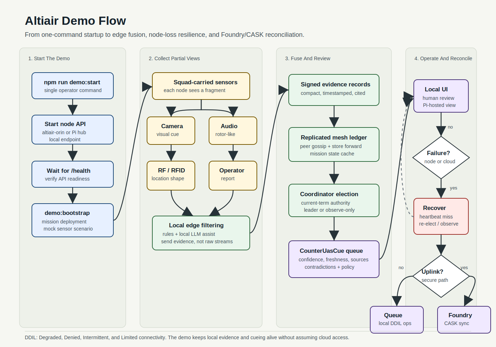
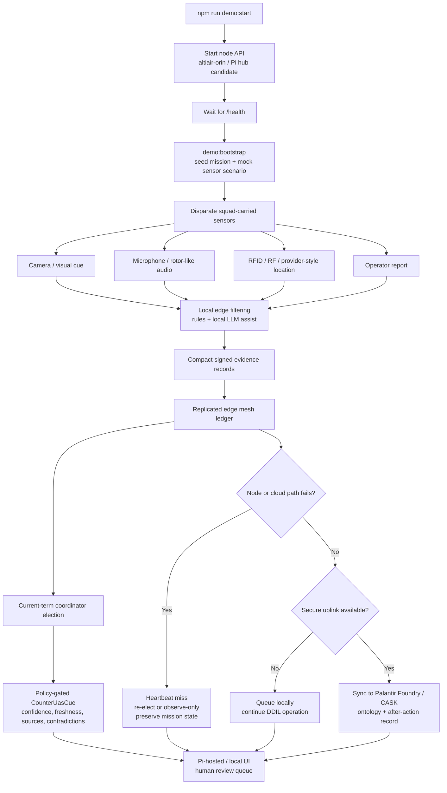

# Altiair Demo Flow Chart

## Editable Mermaid Source

```mermaid
flowchart TD
  Start["npm run demo:start"] --> API["Start node API\naltiair-orin / Pi hub candidate"]
  API --> Health["Wait for /health"]
  Health --> Bootstrap["demo:bootstrap\nseed mission + mock sensor scenario"]

  Bootstrap --> Sensors["Disparate squad-carried sensors"]
  Sensors --> Camera["Camera / visual cue"]
  Sensors --> Audio["Microphone / rotor-like audio"]
  Sensors --> Rfid["RFID / RF / provider-style location"]
  Sensors --> Report["Operator report"]

  Camera --> LocalFilter["Local edge filtering\nrules + local LLM assist"]
  Audio --> LocalFilter
  Rfid --> LocalFilter
  Report --> LocalFilter

  LocalFilter --> Evidence["Compact signed evidence records"]
  Evidence --> Mesh["Replicated edge mesh ledger"]
  Mesh --> Coordinator["Current-term coordinator election"]
  Coordinator --> Cue["Policy-gated CounterUasCue\nconfidence, freshness, sources, contradictions"]
  Cue --> UI["Pi-hosted / local UI\nhuman review queue"]

  Mesh --> Failure{"Node or cloud path fails?"}
  Failure -- "No" --> Foundry{"Secure uplink available?"}
  Failure -- "Yes" --> Reconcile["Heartbeat miss\nre-elect or observe-only\npreserve mission state"]
  Reconcile --> UI

  Foundry -- "Yes" --> Sync["Sync to Palantir Foundry / CASK\nontology + after-action record"]
  Foundry -- "No" --> Queue["Queue locally\ncontinue DDIL operation"]
  Queue --> UI
  Sync --> UI
```
