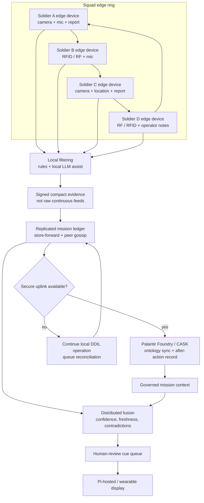

# Altiair Product Flow Chart

Altiair is a squad-level edge intelligence mesh. Each soldier carries an edge device that gathers local sensor data, filters it locally, exchanges compact evidence with nearby peers in a resilient ring, and syncs mission records to Palantir Foundry/CASK when a secure data link exists.

## Product Flow

## Logo Note

This chart uses text wordmark badges for `Altiair`, `Raspberry Pi`, `NVIDIA Jetson`, and `Palantir Foundry` rather than embedding copied trademark artwork. NVIDIA's public brand page says logo use requires authorization, Raspberry Pi offers a separate application path for `Powered by Raspberry Pi` logo use, and the public Palantir SVG reference carries trademark caveats. Keeping text badges avoids implying endorsement while still making the product stack clear.

References:

- NVIDIA logo and brand guidelines: https://www.nvidia.com/en-gb/about-nvidia/legal-info/logo-brand-usage/
- Raspberry Pi `Powered by Raspberry Pi` application: https://www.raspberrypi.com/trademark-rules/powered-raspberry-pi/
- Palantir Technologies SVG reference and trademark caveat: https://commons.m.wikimedia.org/wiki/File%3APalantir_Technologies_logo.svg
