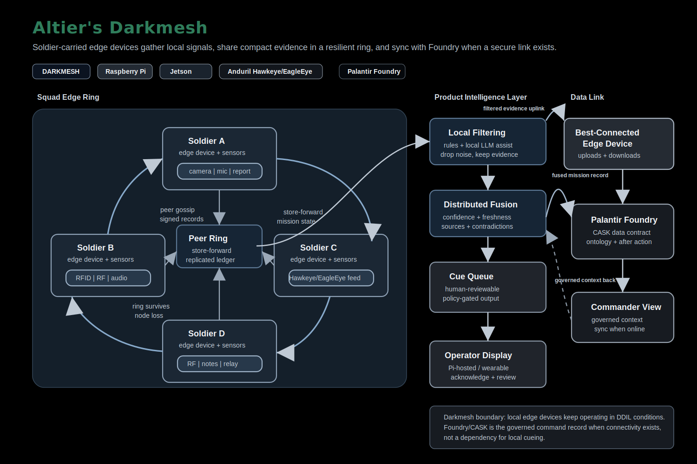
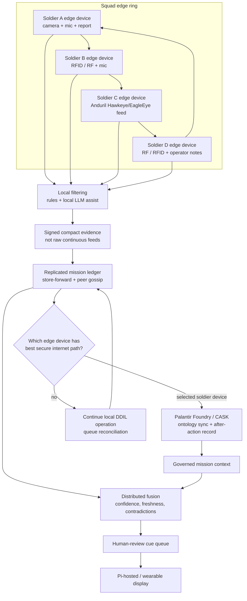

# Altier's Darkmesh Product Flow Chart

Darkmesh is a squad-level edge intelligence mesh. Each soldier carries an edge device that gathers local sensor data, filters it locally, exchanges compact evidence with nearby peers in a resilient ring, and can upload to or download from Palantir Foundry/CASK when that device has the best secure internet path.

## Product Flow

## Logo Note

This chart uses text wordmark/logo badges for `Darkmesh`, `Raspberry Pi`, `NVIDIA Jetson`, `Anduril Hawkeye/EagleEye`, and `Palantir Foundry` rather than embedding copied trademark artwork. NVIDIA's public brand page says logo use requires authorization, Raspberry Pi offers a separate application path for `Powered by Raspberry Pi` logo use, Anduril public logo references carry trademark caveats, and the public Palantir SVG reference carries trademark caveats. Keeping text badges avoids implying endorsement while still making the product stack clear.

Product naming note: the public Anduril product page I found is `EagleEye`; I did not find an official Anduril product page named `Hawkeye`. The diagram keeps `Hawkeye/EagleEye` as a candidate sensor/feed label until the team confirms the exact product name to show judges or partners.

References:

- NVIDIA logo and brand guidelines: https://www.nvidia.com/en-gb/about-nvidia/legal-info/logo-brand-usage/
- Raspberry Pi `Powered by Raspberry Pi` application: https://www.raspberrypi.com/trademark-rules/powered-raspberry-pi/
- Anduril EagleEye product page: https://www.anduril.com/eagleeye/
- Anduril logo SVG reference and trademark caveat: https://commons.wikimedia.org/wiki/File%3AAnduril_Industries_Logo.svg
- Palantir Technologies SVG reference and trademark caveat: https://commons.m.wikimedia.org/wiki/File%3APalantir_Technologies_logo.svg
