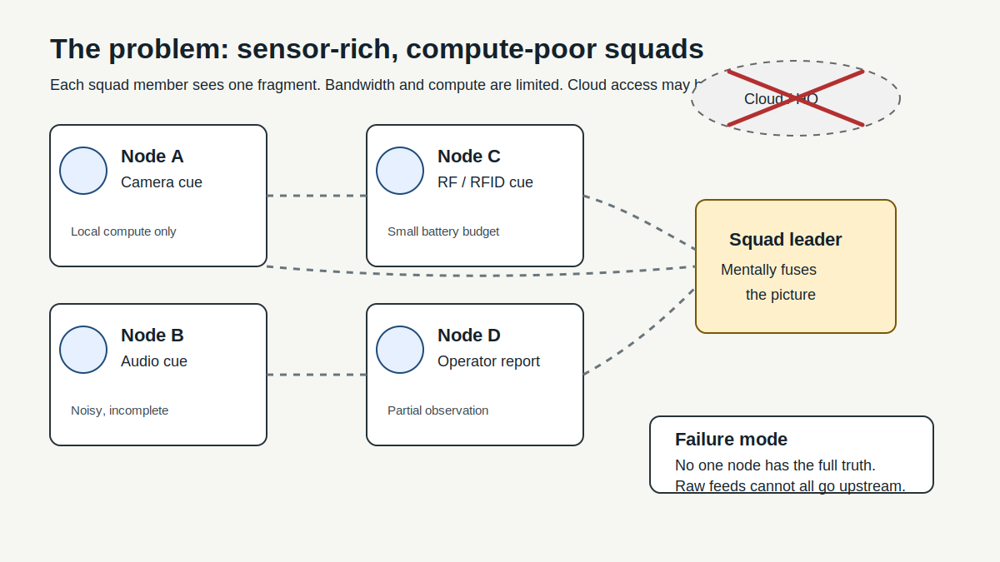
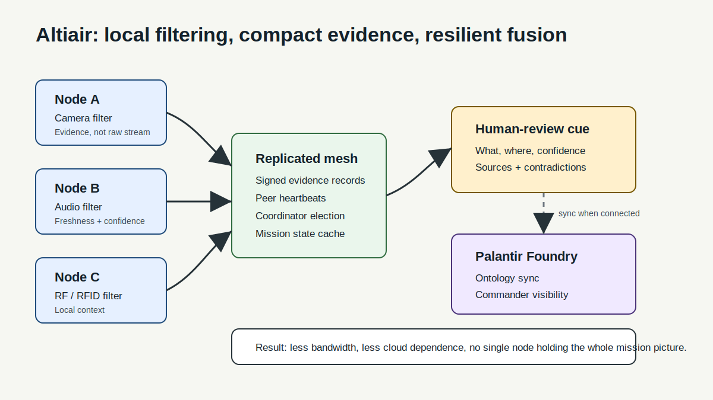
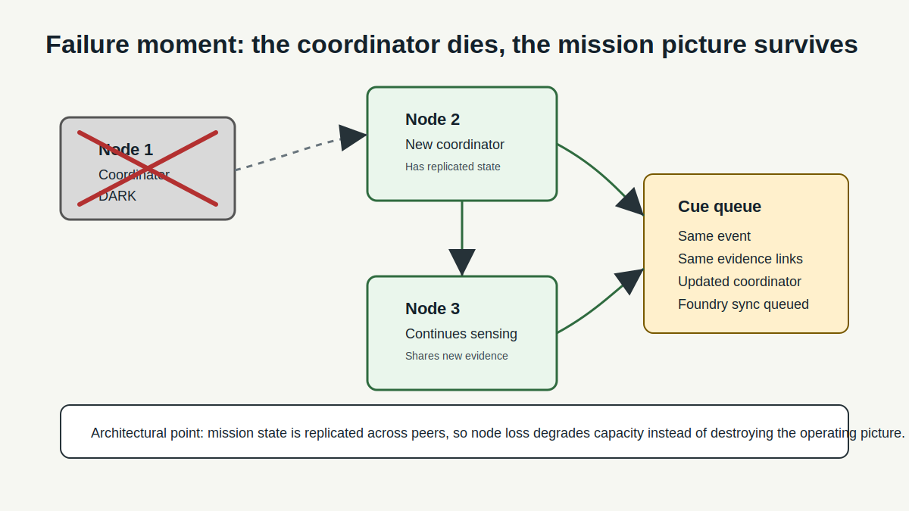

# Altiair: Resilient Edge Intelligence for Contested Operations

Altiair coordinates low-cost soldier-carried sensors into meaningful intelligence when bandwidth, cloud access, and compute are limited.

DDIL means **Degraded, Denied, Intermittent, and Limited** connectivity. In plain English: the network is unreliable, the cloud may be gone, and the squad still has to understand what is happening.

---

## Opening: The Problem

Modern squads are becoming sensor-rich but compute-poor.

One soldier has a camera. Another has a microphone. Another has RFID, RF, or location context. A fourth has an operator report. Individually, each feed is noisy and incomplete. The hard problem is not only DDIL communications. It is coordinating many weak, local observations across squad members and turning them into one explainable intelligence cue before the information goes stale.

Today, that fusion often depends on a leader, a vehicle, a cloud service, or an expensive integrated kit. If that node drops, the picture fragments. If bandwidth is limited, raw sensor data cannot all be shipped upstream. If the hardware is too heavy or too expensive, it will not scale to every squad member.

Altiair solves the missing middle: lightweight, easily procurable edge nodes that filter locally, share only useful evidence, and coordinate with each other to produce a human-reviewable operating picture.

---

## Why Cost And Weight Matter

This is not a replacement for certified tactical radios, IVAS, Nett Warrior, or Palantir. It is a low-cost edge intelligence layer that can sit beside them and feed them.

Public cost anchors show why that matters:

- Army IVAS 1.2 procurement planning requested **$255M for 3,162 systems**, roughly **$80K per kit before RDT&E**, sustainment, and program overhead. The kit includes HUD/puck hardware, batteries, chargers, and tactical cloud package. Source: [DefenseScoop, March 13 2024](https://defensescoop.com/2024/03/13/army-ivas-procurement-fiscal-2025-microsoft/).
- Nett Warrior is a body-worn situational-awareness system with radio, display, and data input device; the Army described it as adding about **five pounds** over the protective vest baseline. Source: [U.S. Army, June 15 2010](https://www.army.mil/article/40883/nett_warrior_to_connect_soldiers_to_each_other_leaders).
- Commodity edge hardware is orders of magnitude cheaper: Raspberry Pi's current product page lists Raspberry Pi 5 16GB at **$205**, while recent Raspberry Pi pricing notes keep lower-memory Pi 4/5 variants in the **$35 to $65** range despite memory-driven price increases. Sources: [Raspberry Pi 5 product page](https://www.raspberrypi.com/5), [Raspberry Pi, Apr. 1 2026](https://www.raspberrypi.com/news/a-new-3gb-raspberry-pi-4-for-83-75-and-more-memory-driven-price-increases/).
- Raspberry Pi Camera Module 3 starts at **$25** and supports full HD video. Source: [Raspberry Pi Camera Module 3](https://www.raspberrypi.com/products/camera-module-3/).
- NVIDIA Jetson Orin Nano Super Developer Kit is listed at **$249** for small edge AI development. Source: [NVIDIA Jetson Orin](https://www.nvidia.com/en-us/autonomous-machines/embedded-systems/jetson-orin/).

Our hackathon bill of materials is intentionally commodity-class: Pi/Jetson nodes, cameras, microphones, RFID/proximity inputs, batteries, and local networking. The prototype target is a few hundred dollars per node, not tens of thousands. The production claim is not "military-certified today"; it is "cheap enough to distribute, useful enough to fuse, and architected for a ruggedized path."

---

## What We Built

Altiair turns disconnected squad-carried sensors into a resilient edge mesh:

1. Each node filters its own sensor feed locally using lightweight edge compute and local LLM-assisted extraction.
2. Nodes exchange compact evidence records instead of streaming every raw feed.
3. A coordinator is elected for the current term, but the mission state is replicated across peers.
4. The system produces a policy-gated cue queue: what was observed, where, confidence, freshness, source sensors, contradictions, and recommended review actions.
5. When connectivity exists, records sync to Palantir Foundry for commander visibility, ontology alignment, and after-action replay.
6. When connectivity disappears, the local mesh keeps operating and queues reconciliation.

The value is not one smarter sensor. The value is sensor coordination under constraint.

---

## Live Demo

Dashboard opens: tactical map, four nodes visible, local-only operation.

Node 1 camera cue: visual model detects a controlled drone marker or test object.

Node 2 audio cue: local microphone model detects rotor-like audio.

Node 3 RF/proximity cue: RF/RFID/provider-style record adds a location or band-context observation.

Node 4 operator report: human input adds a short observation.

Fusion layer: the dashboard combines weak signals into one `CounterUasCue` with confidence, freshness, source links, and contradictions.

Local coordinator: a node-local LLM summarizes the evidence and proposes human-review actions:

- Maintain observation of the cue zone.
- Confirm signal freshness from another node.
- Mark uncertainty and contradictions.
- Queue the cue for operator acknowledgement.

Narration:

> Four squad members, four weak signals. Alone, each one is noisy. Together, the mesh produces an explainable cue that a human can review. We are not shipping raw video to the cloud. We are filtering at the edge, sharing compact evidence, and keeping the squad informed even when the network is degraded, denied, intermittent, or limited.

---

## Failure Moment

Now we simulate the failure that breaks centralized systems: the current coordinator goes dark.

Most systems show resilience in software simulation. We built the failure moment in hardware, running live.

Physically unplug Node 1 or kill it on screen.

On screen, judges should see:

- Node 1 card goes gray: `DARK`.
- Heartbeat missed indicator appears.
- `Coordinator re-electing...` flashes.
- Node 2 assumes the coordinator role.
- The cue queue remains intact.
- New evidence continues to arrive.
- Foundry sync remains queued until connectivity returns.

Narration:

> Node 2 detected the missed heartbeat. It already had the mission state because evidence is replicated across the mesh, not trapped in one command node. The leader changed, but the operating picture survived.

Punchline:

> Altiair does not depend on a single command node. If a node fails, the squad does not lose the mission picture.

---

## Palantir Foundry Integration

When any node regains secure connectivity, the full mission record syncs to Palantir Foundry:

- sensor events
- fusion decisions
- coordinator terms
- cue queue state
- policy gates
- operator acknowledgements
- after-action replay records

Offline, Altiair keeps the Foundry/CASK-shaped data contract at the edge. Online, Foundry becomes the command echelon, audit layer, and long-term system of record.

---

## Images To Show The Problem

Use three visuals in the pitch or demo deck:

1. **Problem image:** squad members each see a different fragment; cloud link is broken; no single device has the truth.
2. **Architecture image:** each node filters locally, shares compact evidence, then the mesh produces a human-reviewable cue and optional Foundry sync.
3. **Failure image:** one coordinator disappears, a new coordinator is elected, mission state persists.

The SVG drafts are in `assets/pitch/` and can be dropped into slides or the README.

---

## Next Steps To Productionize

1. Hardware ruggedization: move from dev boards to a sealed carrier board, validated battery pack, sensor connectors, thermal design, and field-serviceable enclosure.
2. Communications hardening: replace demo LAN assumptions with WireGuard/mTLS identity, tactical radio adapters, MANET/private 5G transport options, and signed peer discovery.
3. Model hardening: benchmark local model latency and power, pin approved model families, add deterministic guardrails, and keep LLM output advisory behind policy gates.
4. Sensor adapters: formalize camera, microphone, RFID, RF, ATAK, and provider-style location adapters behind the same evidence schema.
5. Foundry/CASK production path: finalize ontology objects, OSDK actions, offline queue semantics, conflict resolution, audit records, and authority-to-operate evidence.
6. Security and compliance: SBOM, dependency scanning, key rotation, secrets handling, event signing, encryption at rest, NIST 800-171/CMMC mapping if CUI enters scope.
7. Field evaluation: measure time-to-cue, false positive rate, bandwidth saved by edge filtering, resilience under node loss, battery life, weight, and operator cognitive load.
8. Procurement path: define a low-cost prototype kit, a rugged pilot kit, and an integration-only software package for existing soldier systems.

---

## Close

Altiair gives every squad member's sensor a voice in the operating picture without requiring every raw feed to reach the cloud. It is cheap enough to distribute, local enough to survive DDIL conditions, and structured enough to plug into Palantir Foundry when the link returns.
